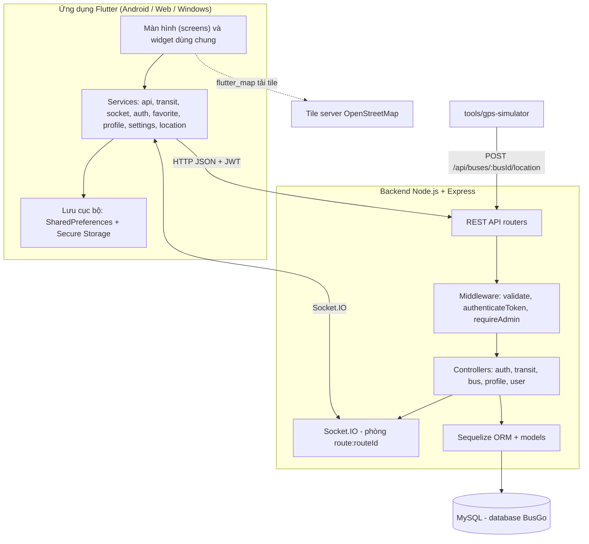
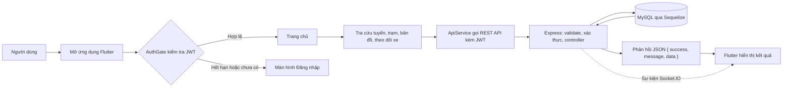
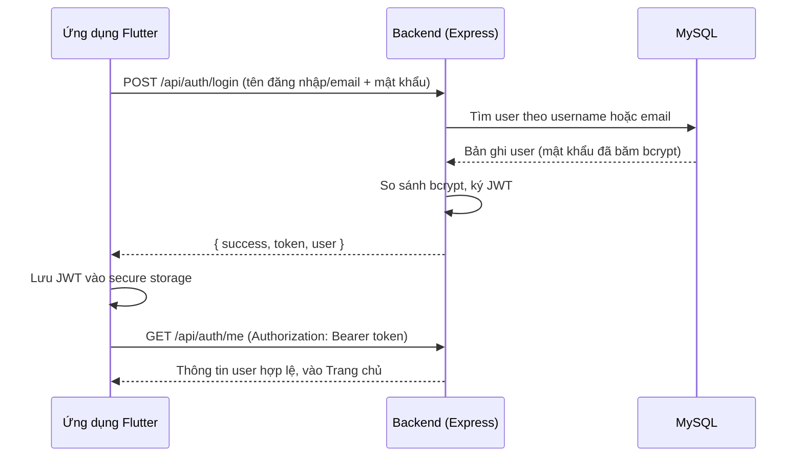
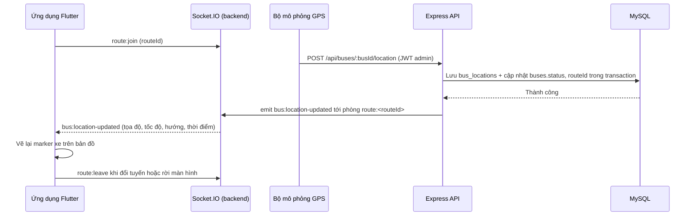
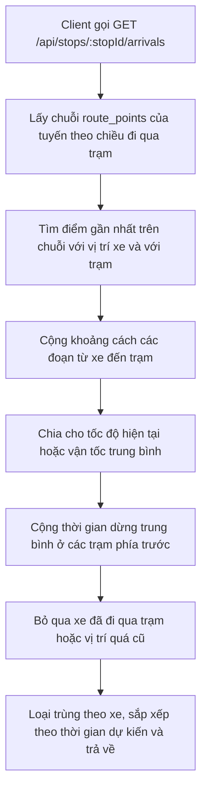
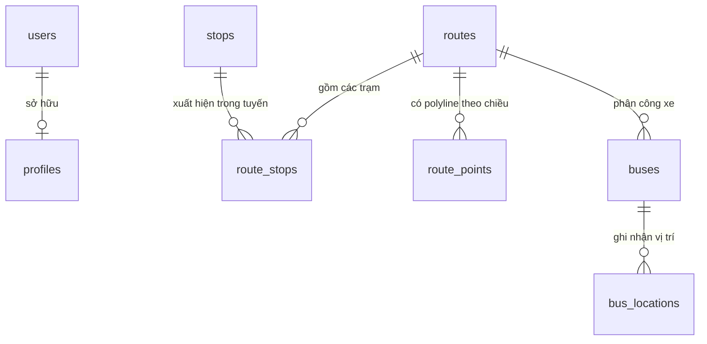

# BusGo – Ứng dụng theo dõi tuyến xe buýt trên thiết bị di động

**BusGo** là tiểu luận môn học "Lập trình trên thiết bị di động", được xây dựng theo mô hình client – server hoàn chỉnh: ứng dụng **Flutter** chạy trên Android/Web/Windows, kết hợp backend **Node.js + Express + MySQL** (Sequelize ORM), xác thực bằng **JWT + bcrypt**, hỗ trợ **đăng nhập Google** và truyền **vị trí xe buýt theo thời gian thực qua Socket.IO**. Ứng dụng phục vụ hành khách tra cứu tuyến, tra cứu trạm, xem lộ trình trên bản đồ OpenStreetMap, theo dõi xe đang chạy và ước lượng thời gian xe đến trạm.

> Quy ước tài liệu: các thông tin chưa thể xác định từ mã nguồn được đánh dấu `[CẦN BỔ SUNG: ...]` và được tổng hợp đầy đủ tại mục 24 để chủ dự án cập nhật sau.

---

## Mục lục

1. [Tổng quan dự án](#1-tổng-quan-dự-án)
2. [Mục tiêu dự án](#2-mục-tiêu-dự-án)
3. [Bối cảnh và bài toán giải quyết](#3-bối-cảnh-và-bài-toán-giải-quyết)
4. [Tính năng chính](#4-tính-năng-chính)
5. [Đối tượng sử dụng](#5-đối-tượng-sử-dụng)
6. [Công nghệ sử dụng](#6-công-nghệ-sử-dụng)
7. [Kiến trúc hệ thống](#7-kiến-trúc-hệ-thống)
8. [Sơ đồ luồng hoạt động](#8-sơ-đồ-luồng-hoạt-động)
9. [Cấu trúc thư mục](#9-cấu-trúc-thư-mục)
10. [Hướng dẫn cài đặt](#10-hướng-dẫn-cài-đặt)
11. [Cấu hình môi trường và biến môi trường](#11-cấu-hình-môi-trường-và-biến-môi-trường)
12. [Chạy dự án ở môi trường phát triển](#12-chạy-dự-án-ở-môi-trường-phát-triển)
13. [Build và triển khai](#13-build-và-triển-khai)
14. [Hướng dẫn sử dụng](#14-hướng-dẫn-sử-dụng)
15. [API và các module quan trọng](#15-api-và-các-module-quan-trọng)
16. [Cơ sở dữ liệu và mô hình dữ liệu](#16-cơ-sở-dữ-liệu-và-mô-hình-dữ-liệu)
17. [Điểm nổi bật kỹ thuật](#17-điểm-nổi-bật-kỹ-thuật)
18. [Khó khăn và cách xử lý](#18-khó-khăn-và-cách-xử-lý)
19. [Kiểm thử](#19-kiểm-thử)
20. [Kết quả đạt được](#20-kết-quả-đạt-được)
21. [Bài học kinh nghiệm](#21-bài-học-kinh-nghiệm)
22. [Hướng phát triển](#22-hướng-phát-triển)
23. [Nội dung có thể đưa vào CV](#23-nội-dung-có-thể-đưa-vào-cv)
24. [Thông tin cần bổ sung](#24-thông-tin-cần-bổ-sung)

---

## 1. Tổng quan dự án

BusGo giải quyết nhu cầu tra cứu và theo dõi xe buýt hằng ngày của hành khách bằng một ứng dụng di động duy nhất: tìm tuyến phù hợp, xem chi tiết tuyến và các trạm theo thứ tự, tìm trạm gần vị trí hiện tại, xem lộ trình trên bản đồ và theo dõi vị trí xe đang chạy theo thời gian thực. Toàn bộ dữ liệu tuyến – trạm – xe – lộ trình – vị trí được quản lý tập trung trong MySQL và cung cấp qua REST API; vị trí xe được đẩy tới ứng dụng ngay khi có cập nhật thông qua Socket.IO.

### 1.1 Bảng thông tin dự án

| Hạng mục | Thông tin |
|---|---|
| Tên dự án | BusGo |
| Loại dự án | Đồ án môn học "Lập trình trên thiết bị di động" |
| Lĩnh vực | Ứng dụng di động / giao thông công cộng |
| Nền tảng | Android (mục tiêu chính), Web và Windows (cấu hình để chạy thử) |
| Mô hình hệ thống | Client – server; REST API kết hợp Socket.IO thời gian thực |
| Ngôn ngữ lập trình | Dart (Flutter), JavaScript (Node.js, ES Module), SQL |
| Cơ sở dữ liệu | MySQL, database `BusGo`, 8 bảng nghiệp vụ |
| Xác thực | JWT (mặc định 7 ngày), bcrypt (10 vòng), Google ID token |
| Bản đồ | OpenStreetMap thông qua `flutter_map` |
| Repository | https://github.com/thanhtrucs-tn/busgo (nhánh `main`) |
| Trạng thái | Các chức năng cốt lõi hoàn thành; một số chức năng mở rộng đang phát triển (chi tiết tại mục 4) |

### 1.2 Quy mô mã nguồn

Số liệu thống kê trực tiếp từ repository ngày 13/09/2026:

| Thành phần | Số file | Số dòng (xấp xỉ) |
|---|---|---|
| Ứng dụng Flutter (`lib/`) | 55 file `.dart` | 9.843 |
| Backend (`server/src/`) | 30 file `.js` | 2.315 |
| Script SQL (`server/sql/`) | 5 file `.sql` | 502 |
| Kiểm thử (`test/`) | 4 file `.dart` | 582 |
| Bộ mô phỏng GPS (`tools/gps-simulator/`) | 2 file `.js` | 198 |
| **Tổng cộng** | **96 file** | **khoảng 13.440 dòng** |

Số liệu chưa bao gồm file cấu hình nền tảng (`android/`, `web/`, `windows/`) và các file sinh tự động.

### 1.3 Điểm nhấn dành cho nhà tuyển dụng

- Dự án full-stack hoàn chỉnh: giao diện di động, REST API, cơ sở dữ liệu, realtime và công cụ mô phỏng dữ liệu.
- Xử lý bài toán không gian địa lý thực tế: công thức Haversine, tìm điểm gần nhất trên polyline, ước lượng thời gian xe đến trạm.
- Truyền dữ liệu thời gian thực bằng Socket.IO theo phòng tuyến, có xử lý tham gia/rời phòng và mất kết nối.
- Áp dụng thực hành bảo mật: băm mật khẩu bcrypt, JWT ký phía máy chủ, xác minh Google token phía máy chủ, tách dữ liệu theo tài khoản, không lưu secret trong mã nguồn.
- Kiểm thử tự động bằng `flutter_test`; trạng thái kiểm chứng ngày 13/09/2026: `flutter analyze` không có lỗi, 16/16 test đạt.

---

## 2. Mục tiêu dự án

### 2.1 Mục tiêu nghiệp vụ

1. Giúp hành khách tra cứu tuyến xe buýt nhanh chóng theo mã tuyến, tên tuyến, điểm đầu và điểm cuối.
2. Giúp xác định trạm dừng: tìm kiếm theo tên/địa chỉ, xem trên bản đồ và xác định trạm gần vị trí hiện tại.
3. Cung cấp thông tin chi tiết tuyến: giờ hoạt động, tần suất chuyến, giá vé và danh sách trạm theo đúng thứ tự hành trình.
4. Giúp theo dõi hành trình: vị trí xe trên bản đồ theo thời gian thực và thời gian dự kiến xe đến trạm.
5. Cá nhân hóa trải nghiệm: tài khoản, hồ sơ, tuyến yêu thích, chế độ sáng/tối và đa ngôn ngữ Việt/Anh.

### 2.2 Mục tiêu kỹ thuật

1. Xây dựng ứng dụng Flutter chạy đa nền tảng (Android, Web, Windows) với cấu trúc mã nguồn rõ ràng.
2. Thiết kế và triển khai REST API bằng Node.js + Express theo định dạng phản hồi chuẩn hóa.
3. Xác thực bằng JWT ký phía máy chủ, băm mật khẩu bằng bcrypt, phân quyền `user`/`admin`.
4. Tích hợp đăng nhập Google với bước xác minh ID token phía máy chủ.
5. Lưu trữ và truy vấn dữ liệu tuyến – trạm – xe – lộ trình – vị trí bằng MySQL + Sequelize.
6. Tích hợp bản đồ OpenStreetMap, vẽ polyline bám lộ trình thật và sử dụng GPS thiết bị.
7. Truyền vị trí xe thời gian thực bằng Socket.IO.
8. Kiểm soát cấu hình qua biến môi trường và `--dart-define`, không hardcode địa chỉ API hay secret.
9. Kiểm thử tự động các luồng chức năng chính và các lỗi dữ liệu đã từng xảy ra.
10. Hoàn thiện tài liệu kỹ thuật phục vụ báo cáo đồ án và hồ sơ năng lực.

### 2.3 Tiêu chí hoàn thành

| Tiêu chí | Kết quả |
|---|---|
| Chức năng cốt lõi hoạt động đầu-cuối với backend thật | Đạt |
| `flutter analyze` không có lỗi | Đạt (kiểm chứng 13/09/2026) |
| Toàn bộ test tự động đạt | Đạt 16/16 (kiểm chứng 13/09/2026) |
| Không có secret trong mã nguồn | Đạt (đọc từ `.env`; repo chỉ chứa `.env.production` mẫu an toàn) |
| Tài liệu cài đặt, API và cơ sở dữ liệu đầy đủ | Đạt (README này cùng các script trong `server/sql` và tài liệu `tools/gps-simulator`) |

---

## 3. Bối cảnh và bài toán giải quyết

### 3.1 Bối cảnh

Xe buýt là phương tiện công cộng phổ biến, nhưng thông tin về tuyến, trạm và vị trí xe thường phân tán hoặc khó tra cứu nhanh trên thiết bị di động. Người đi xe thường mất thời gian để trả lời các câu hỏi: đi tuyến nào, trạm gần nhất ở đâu, tuyến có bao nhiêu trạm, xe đang ở đâu và bao lâu nữa thì tới. Trong khuôn khổ đồ án môn "Lập trình trên thiết bị di động", BusGo được chọn để giải quyết các câu hỏi trên bằng một ứng dụng Flutter kết nối backend thật, có cơ sở dữ liệu, xác thực và dữ liệu thời gian thực.

### 3.2 Các bài toán cụ thể

| STT | Bài toán của người dùng | Giải pháp trong BusGo |
|---|---|---|
| 1 | Khó tìm tuyến phù hợp giữa danh sách tuyến dài | Danh sách tuyến kèm hộp tìm kiếm theo mã tuyến, tên tuyến, điểm đầu và điểm cuối |
| 2 | Khó xác định trạm dừng đang đứng | Danh sách trạm kèm tìm kiếm theo tên/địa chỉ; xem trạm trên bản đồ; tính trạm gần vị trí hiện tại bằng Haversine |
| 3 | Không biết thông tin chi tiết của tuyến | Trang chi tiết tuyến: giờ hoạt động, tần suất, giá vé, điểm đầu – điểm cuối, toàn bộ trạm dạng timeline và xe đang chạy trên tuyến |
| 4 | Không biết xe đang ở đâu, bao lâu nữa tới trạm | Bản đồ hiển thị polyline và marker xe cập nhật thời gian thực qua Socket.IO; danh sách xe sắp tới trạm kèm khoảng cách và thời gian dự kiến |
| 5 | Chưa có thiết bị GPS thật để demo | Công cụ `tools/gps-simulator` mô phỏng xe chạy dọc `route_points` và gửi vị trí qua đúng API nghiệp vụ |
| 6 | Dữ liệu không được cá nhân hóa, dễ lẫn giữa các tài khoản | Tài khoản + hồ sơ theo JWT; dữ liệu yêu thích và hồ sơ được tách theo từng tài khoản, có test hồi quy chống rò rỉ |

### 3.3 Phạm vi dự án

**Trong phạm vi đã triển khai:**

- Ứng dụng Flutter (Android, Web, Windows) với các màn hình tra cứu, bản đồ, theo dõi xe, hồ sơ, cài đặt.
- Backend REST API + Socket.IO; xác thực JWT, bcrypt, Google; phân quyền user/admin.
- Cơ sở dữ liệu MySQL 8 bảng, script DDL và dữ liệu mẫu.
- Bộ mô phỏng GPS phục vụ demo.
- Kiểm thử tự động các luồng chính và các lỗi tách dữ liệu.

**Ngoài phạm vi (chưa triển khai):**

- GPS thật trên xe và vai trò tài xế (`driver`).
- Giao diện quản trị trên ứng dụng.
- Thông báo đẩy thật (push notification) và bản đồ ngoại tuyến.
- Thanh toán vé và dữ liệu giao thông thực tế cho ETA.

---

## 4. Tính năng chính

### 4.1 Xác thực và tài khoản

| STT | Chức năng | Mô tả | Trạng thái |
|---|---|---|---|
| 1 | Đăng ký tài khoản | Tên đăng nhập 3–32 ký tự (chữ, số, gạch dưới), mật khẩu 6–64 ký tự, email tùy chọn; gọi `POST /api/auth/register` | Hoàn thành |
| 2 | Đăng nhập | Bằng tên đăng nhập hoặc email + mật khẩu; kiểm tra bcrypt, trả về JWT | Hoàn thành |
| 3 | Đăng nhập/đăng ký nhanh bằng Google | Mở hộp thoại Google, gửi ID token lên máy chủ xác minh; tự tạo tài khoản hoặc liên kết nếu trùng email | Hoàn thành |
| 4 | Kiểm tra phiên khi mở app | `AuthGate` đọc JWT trong secure storage, gọi `GET /api/auth/me`; hợp lệ vào Trang chủ, hết hạn về Đăng nhập | Hoàn thành |
| 5 | Ghi nhớ đăng nhập | Tùy chọn điền sẵn tên đăng nhập cho lần đăng nhập sau | Hoàn thành |
| 6 | Đăng xuất | Xóa JWT khỏi secure storage, xóa cache dữ liệu theo tài khoản và quay về Đăng nhập | Hoàn thành |
| 7 | Hồ sơ cá nhân | Xem/sửa họ tên, email, số điện thoại, ngày sinh, ảnh đại diện, danh sách địa chỉ và địa chỉ mặc định; tự điền địa chỉ từ GPS | Hoàn thành |
| 8 | Phân quyền user/admin | Backend quy định API `PROTECTED` (cần JWT) và `ADMIN` (chỉ `role = admin`) | Hoàn thành (phần API; giao diện quản trị chưa có) |

### 4.2 Tra cứu tuyến xe

| STT | Chức năng | Mô tả | Trạng thái |
|---|---|---|---|
| 1 | Danh sách tuyến | Hiển thị mã tuyến, điểm đi – điểm đến, số trạm | Hoàn thành |
| 2 | Chi tiết tuyến | Số tuyến, tên tuyến, điểm đầu/cuối, giờ hoạt động, tần suất, giá vé, danh sách trạm dạng timeline, danh sách xe đang chạy | Hoàn thành |
| 3 | Yêu thích tuyến | Thêm/bỏ yêu thích; lưu cục bộ theo tài khoản; có màn hình riêng | Hoàn thành |
| 4 | Thống kê tuyến | Tổng quan số tuyến, số trạm, số xe; thống kê trạm có nhiều tuyến nhất, tuyến nhiều trạm nhất, xe theo tuyến | Hoàn thành |

### 4.3 Tra cứu trạm xe buýt

| STT | Chức năng | Mô tả | Trạng thái |
|---|---|---|---|
| 1 | Danh sách trạm | Tên trạm, địa chỉ, số tuyến đi qua trạm | Hoàn thành |
| 2 | Chi tiết trạm | Địa chỉ, tọa độ, danh sách tuyến đi qua trạm (kèm chiều và thứ tự trạm) | Hoàn thành |
| 3 | Xe đang đến trạm (ETA) | Danh sách xe sắp tới trạm kèm khoảng cách và thời gian dự kiến theo `route_points`; hiển thị rõ "Dữ liệu mô phỏng" | Hoàn thành |
| 4 | Trạm gần tôi | Gọi `GET /api/stops/nearby` (Haversine) kèm `distanceMeters`; chế độ chỉ hiển thị trạm gần nhất | Hoàn thành |

### 4.4 Tìm kiếm

| STT | Chức năng | Mô tả | Trạng thái |
|---|---|---|---|
| 1 | Tìm kiếm tuyến | Lọc theo mã tuyến, tên tuyến, điểm đầu hoặc điểm cuối | Hoàn thành |
| 2 | Tìm kiếm trạm | Lọc theo tên hoặc địa chỉ (không phân biệt hoa/thường) | Hoàn thành |

### 4.5 Bản đồ và vị trí

| STT | Chức năng | Mô tả | Trạng thái |
|---|---|---|---|
| 1 | Bản đồ tuyến và trạm | Nền OpenStreetMap có attribution; marker trạm; chọn tuyến để vẽ polyline bám `route_points`; chuyển chiều đi/chiều về; bottom sheet thông tin tuyến và trạm | Hoàn thành |
| 2 | Lấy vị trí hiện tại | Dùng `geolocator` kiểm tra dịch vụ định vị, xin quyền, lấy tọa độ và hiển thị marker "Vị trí của bạn" | Hoàn thành |
| 3 | Theo dõi vị trí xe | Marker xe của tuyến đang chọn, cập nhật thời gian thực qua Socket.IO (`bus:location-updated`), có xử lý mất kết nối và tự tham gia lại phòng tuyến | Hoàn thành (dữ liệu mô phỏng) |
| 4 | Bộ mô phỏng GPS | Công cụ Node.js gửi vị trí xe dọc theo `route_points` lên API khi chưa có GPS thật | Hoàn thành |

### 4.6 Hồ sơ, cài đặt và tiện ích

| STT | Chức năng | Mô tả | Trạng thái |
|---|---|---|---|
| 1 | Hồ sơ cá nhân | Họ tên, email, số điện thoại, ngày sinh, ảnh đại diện (base64), danh sách địa chỉ và địa chỉ mặc định; định vị GPS để tự điền địa chỉ | Hoàn thành |
| 2 | Cài đặt ứng dụng | Chế độ tối/sáng, chọn ngôn ngữ Tiếng Việt/English, tùy chọn nhận thông báo | Hoàn thành |
| 3 | Đa ngôn ngữ | Hệ thống `l10n` tự xây dựng cho vi/en, không dùng codegen `intl` | Hoàn thành |
| 4 | Thông báo trong ứng dụng | Danh sách thông báo (xe đến trạm, sự cố tuyến, tin tức, tài khoản), lọc theo tab, đánh dấu đã đọc, vuốt để xóa | Đang phát triển (dùng dữ liệu mẫu) |
| 5 | Xóa bộ nhớ đệm / bản đồ ngoại tuyến | Nút xóa cache và tải bản đồ ngoại tuyến trong Cài đặt | Đang phát triển |
| 6 | Trợ lý ảo (VA) | Nút tròn "VA" trên Trang chủ, hiện hộp thoại giới thiệu trợ lý ảo | Dự kiến phát triển |

### 4.7 Backend và dữ liệu

| STT | Chức năng | Mô tả | Trạng thái |
|---|---|---|---|
| 1 | REST API xác thực | Đăng ký, đăng nhập, đăng nhập Google, lấy thông tin user hiện tại; bcrypt; ký và kiểm tra JWT | Hoàn thành |
| 2 | REST API tuyến – trạm – xe | Danh sách/chi tiết tuyến, trạm của tuyến, polyline, xe của tuyến, danh sách trạm, trạm gần vị trí, tuyến của trạm, dự kiến xe đến trạm | Hoàn thành |
| 3 | Cập nhật vị trí xe | `POST /api/buses/:busId/location` (JWT + admin), lưu giao dịch (transaction), phát Socket.IO | Hoàn thành |
| 4 | Socket.IO | Phòng `route:<routeId>`, sự kiện `route:join`, `route:leave`, `bus:location-updated`, `bus:status-updated` | Hoàn thành |
| 5 | Cơ sở dữ liệu | Database `BusGo`, 8 bảng, khóa ngoại, chỉ mục, ràng buộc CHECK, charset utf8mb4; Sequelize tự đồng bộ bảng khi khởi động | Hoàn thành |
| 6 | Giao diện quản trị | Màn hình quản lý tài khoản/người dùng trên ứng dụng | Dự kiến phát triển |

---

## 5. Đối tượng sử dụng

### 5.1 Các nhóm người dùng

| Đối tượng | Đặc điểm | Nhu cầu chính | Chức năng tương ứng |
|---|---|---|---|
| Hành khách (người đi xe buýt) | Sử dụng điện thoại di động, cần thông tin nhanh khi di chuyển | Tìm tuyến, tìm trạm, xem lộ trình, biết xe đang ở đâu, lưu tuyến hay đi | Đăng ký/đăng nhập, tra cứu tuyến – trạm, bản đồ, theo dõi xe, ETA, yêu thích, hồ sơ |
| Quản trị viên hệ thống | Quản lý tài khoản và vận hành dữ liệu xe | Xem danh sách tài khoản, cập nhật vị trí xe phục vụ vận hành | Các API `ADMIN`, endpoint cập nhật vị trí xe, bộ mô phỏng GPS |
| Nhóm phát triển và người đánh giá | Giảng viên, hội đồng, lập trình viên kế thừa | Hiểu nhanh kiến trúc, chạy thử và kiểm chứng dự án | Tài liệu README, script SQL, test tự động, bộ mô phỏng |

### 5.2 Kịch bản sử dụng tiêu biểu

**Kịch bản 1 – Tìm đường đi xe buýt:**

1. Người dùng mở app, đăng nhập (hoặc đăng nhập nhanh bằng Google).
2. Tại Trang chủ, chọn "Tuyến xe", gõ từ khóa vào ô tìm kiếm.
3. Mở chi tiết tuyến, xem giờ hoạt động, giá vé và danh sách trạm theo thứ tự.
4. Chuyển sang Bản đồ, chọn tuyến để xem polyline và các trạm trên lộ trình.
5. Nhấn "Lấy vị trí hiện tại" để xem trạm gần nhất và khoảng cách.
6. Thêm tuyến vào danh sách yêu thích để truy cập nhanh lần sau.

**Kịch bản 2 – Theo dõi xe đang chạy:**

1. Người dùng mở Bản đồ, chọn tuyến cần theo dõi.
2. Ứng dụng gửi `route:join` để vào phòng `route:<routeId>`.
3. Bộ mô phỏng GPS gửi vị trí xe lên API; backend lưu vào MySQL và phát `bus:location-updated`.
4. Ứng dụng nhận sự kiện và vẽ lại marker xe trên bản đồ.
5. Người dùng mở chi tiết trạm để xem xe sắp tới và thời gian dự kiến.

---

## 6. Công nghệ sử dụng

### 6.1 Ứng dụng Flutter

| Thành phần | Công nghệ | Phiên bản khai báo | Vai trò |
|---|---|---|---|
| Ngôn ngữ và framework | Dart + Flutter | Dart SDK `^3.12.0`; kiểm thử với Flutter 3.44.2 / Dart 3.12.2 | Xây dựng giao diện đa nền tảng |
| Quản lý trạng thái | `ChangeNotifier` / `ListenableBuilder`, dịch vụ singleton | Không dùng thư viện ngoài | Phân tách logic khỏi giao diện |
| Giao tiếp REST | `http` | `^1.5.0` | Gọi API, tự gắn JWT |
| Realtime | `socket_io_client` | `^3.1.6` | Nhận vị trí xe thời gian thực |
| Bản đồ | `flutter_map`, `latlong2`, `google_polyline_algorithm` | `^8.3.1`, `^0.10.1`, `^3.1.0` | Hiển thị bản đồ, polyline, marker |
| GPS và vị trí | `geolocator` | `^14.0.3` | Quyền định vị, tọa độ, khoảng cách |
| Lưu trữ cục bộ | `shared_preferences`, `flutter_secure_storage` | `^2.5.5`, `^11.0.0` | Cài đặt, yêu thích, nhớ đăng nhập; JWT lưu an toàn |
| Đăng nhập Google | `google_sign_in`, `google_sign_in_web` | `^7.2.0`, `^1.1.3` | Lấy ID token Google |
| Ảnh đại diện | `image_picker` | `^1.1.2` | Chọn ảnh từ thư viện |
| Biểu tượng | `cupertino_icons` | `^1.0.8` | Bộ icon bổ sung |
| Lint | `flutter_lints` | `^6.0.0` | Chuẩn hóa chất lượng mã nguồn |

### 6.2 Backend

| Thành phần | Công nghệ | Phiên bản khai báo | Vai trò |
|---|---|---|---|
| Nền tảng | Node.js (ES Module) | >= 18 khuyến nghị | Chạy máy chủ API |
| Web framework | Express | `^4.19.2` | Định tuyến, middleware |
| ORM | Sequelize | `^6.37.8` | Ánh xạ model, truy vấn, transaction |
| Trình điều khiển CSDL | `mysql2` | `^3.11.0` | Kết nối MySQL |
| Xác thực | `jsonwebtoken`, `bcryptjs` | `^9.0.3`, `^2.4.3` | Ký/kiểm tra JWT, băm mật khẩu |
| Google | `google-auth-library` | `^9.11.0` | Xác minh ID token |
| Realtime | `socket.io` | `^4.7.5` | Phát vị trí và trạng thái xe |
| Cấu hình | `dotenv` | `^16.4.5` | Nạp biến môi trường |
| CORS | `cors` | `^2.8.5` | Giới hạn nguồn client |

### 6.3 Cơ sở dữ liệu, công cụ và kiểm thử

| Thành phần | Công nghệ | Ghi chú |
|---|---|---|
| Cơ sở dữ liệu | MySQL | Database `BusGo`, charset utf8mb4, hỗ trợ tiếng Việt; phiên bản đã kiểm thử `[CẦN BỔ SUNG: phiên bản MySQL/XAMPP đã dùng]` |
| Bộ mô phỏng GPS | Node.js >= 18 (`fetch` có sẵn) | Thư mục `tools/gps-simulator` |
| Đa ngôn ngữ | Hệ thống `l10n` tự xây dựng | Tiếng Việt và English, không dùng codegen `intl` |
| Kiểm thử | `flutter_test` | 4 bộ test, 16 test case |
| Quản lý mã nguồn | Git / GitHub | Repository công khai, nhánh `main` |
| Đóng gói và triển khai | Flutter build (APK, appbundle, web, windows) | Chưa có cấu hình Docker/CI-CD trong repository |

Các công cụ như Postman, XAMPP, Docker: chưa được cấu hình trong mã nguồn; `[CẦN BỔ SUNG nếu đã sử dụng trong quá trình làm đồ án]`.

---

## 7. Kiến trúc hệ thống

### 7.1 Sơ đồ kiến trúc tổng thể



### 7.2 Phân lớp trách nhiệm

| Lớp | Thành phần tiêu biểu | Trách nhiệm |
|---|---|---|
| Trình bày | `lib/screens`, `lib/widgets`, `lib/theme`, `lib/l10n` | Hiển thị giao diện, điều hướng, trạng thái lỗi/rỗng, đa ngôn ngữ, chủ đề sáng/tối |
| Dịch vụ | `lib/services` | Gọi API, quản lý phiên, lưu trữ cục bộ, Socket.IO, GPS, geocoding |
| Mô hình | `lib/models` | Ánh xạ JSON từ API sang đối tượng Dart |
| API | `server/src/routes`, `middlewares`, `controllers` | Định tuyến, validate, xác thực, xử lý nghiệp vụ, định dạng phản hồi |
| Dữ liệu | `server/src/models`, `server/src/config/db.js` | Định nghĩa model, quan hệ, kết nối và đồng bộ Sequelize |
| Realtime | `server/src/realtime/socket.js` | Quản lý phòng theo tuyến, phát sự kiện vị trí và trạng thái xe |
| Công cụ | `tools/gps-simulator` | Sinh dữ liệu vị trí xe phục vụ demo khi chưa có GPS thật |
| Tiện ích | `server/src/utils` | JWT, bcrypt, xác minh Google, định dạng phản hồi, tính toán địa lý |

### 7.3 Luồng xử lý một yêu cầu

1. Người dùng thao tác trên màn hình Flutter; màn hình gọi dịch vụ tương ứng trong `lib/services`.
2. Dịch vụ gọi REST API qua `ApiService`, tự đính kèm header `Authorization: Bearer <JWT>` khi cần.
3. Backend tiếp nhận tại router (`server/src/routes`), đi qua middleware validate và xác thực (`authenticateToken`, `requireAdmin`).
4. Controller xử lý nghiệp vụ, truy vấn hoặc cập nhật dữ liệu qua Sequelize.
5. MySQL trả kết quả; controller đóng gói theo định dạng `{ success, message, data }`.
6. Với thao tác cập nhật vị trí xe, sau khi lưu thành công backend phát sự kiện Socket.IO tới phòng tuyến tương ứng.
7. Flutter nhận JSON (hoặc sự kiện Socket.IO), cập nhật trạng thái và vẽ lại giao diện.
8. Mọi lỗi được chuyển thành thông báo thân thiện bằng tiếng Việt; không trả stack trace ra ngoài.

### 7.4 Các quyết định thiết kế quan trọng

| Quyết định | Lý do | Đánh đổi |
|---|---|---|
| REST API + Socket.IO trên cùng cổng HTTP | Một máy chủ, một cổng triển khai; REST cho dữ liệu ít thay đổi, Socket.IO cho dữ liệu thay đổi liên tục | Phải giữ hai cơ chế đồng bộ với nhau |
| Sequelize ORM | Khai báo model một nơi, tự đồng bộ bảng khi khởi động, quản lý quan hệ và transaction | Một số ràng buộc nâng cao phải bổ sung bằng SQL thủ công |
| Polyline lưu trong bảng riêng `route_points` | Tuyến bám theo đường thật thay vì nối thẳng các trạm; hỗ trợ tính khoảng cách theo lộ trình | Cần thêm dữ liệu và truy vấn cho mỗi tuyến/chiều |
| JWT lưu trong secure storage | Token không nằm trong file văn bản thường | Phụ thuộc keystore của nền tảng |
| Quản lý trạng thái bằng `ChangeNotifier` + singleton | Không cần thư viện ngoài, phù hợp quy mô đồ án | Tự quản lý vòng đời và hủy listener để tránh rò rỉ |
| Dữ liệu mô phỏng cho vị trí xe | Chưa có thiết bị GPS thật | Phải ghi rõ "dữ liệu mô phỏng" để tránh hiểu nhầm |
| Tách bảng `profiles` theo `user_id` | Sửa lỗi rò rỉ hồ sơ giữa các tài khoản | Thêm một bảng và một số truy vấn |

---

## 8. Sơ đồ luồng hoạt động

### 8.1 Luồng tổng quát



### 8.2 Luồng đăng nhập



### 8.3 Luồng theo dõi xe thời gian thực



### 8.4 Luồng ước lượng xe đến trạm (ETA)



---

## 9. Cấu trúc thư mục

```text
busgo/
├── lib/                              # Mã nguồn ứng dụng Flutter (55 file Dart)
│   ├── main.dart                     # Khởi động app, cấu hình theme/ngôn ngữ, gọi AuthGate
│   ├── config/                       # Cấu hình tập trung
│   │   ├── api_config.dart           #   Địa chỉ API + Socket.IO, ghi đè bằng --dart-define
│   │   ├── tile_config.dart          #   Nguồn tile bản đồ + attribution (OSM/Esri)
│   │   └── google_config.dart        #   Client ID Google (Web/Android)
│   ├── data/                         # Dữ liệu mẫu còn dùng cho test/offline
│   ├── l10n/                         # Hệ thống đa ngôn ngữ vi/en tự xây dựng
│   ├── models/                       # BusRoute, BusStop, Bus, RoutePoint, RouteStop, BusLocation,
│   │                                 #   StopArrival, NearbyStop, UserAccount, AppNotification...
│   ├── screens/                      # Các màn hình
│   │   ├── auth/                     #   auth_gate.dart, login_screen.dart, register_screen.dart
│   │   ├── home_screen.dart          #   Trang chủ: lưới chức năng, menu dưới, nút trợ lý ảo
│   │   ├── bus_route_list_screen.dart / route_detail_screen.dart
│   │   ├── bus_stop_list_screen.dart / stop_detail_screen.dart
│   │   ├── map_screen.dart           #   Bản đồ, polyline, marker trạm/xe, chọn chiều, trạm gần tôi
│   │   ├── bus_tracking_screen.dart  #   Theo dõi xe realtime (API + Socket.IO)
│   │   ├── favorite_screen.dart      #   Tuyến yêu thích theo tài khoản
│   │   ├── statistics_screen.dart    #   Thống kê tuyến/trạm/xe
│   │   ├── notification_screen.dart  #   Thông báo (đang phát triển)
│   │   ├── settings_screen.dart      #   Cài đặt: theme, ngôn ngữ, thông báo, cache
│   │   └── profile_screen.dart / edit_profile_screen.dart
│   ├── services/                     # Lớp dịch vụ (13 file)
│   │   ├── api_service.dart          #   HTTP client, tự gắn JWT
│   │   ├── auth_service.dart         #   Đăng ký/đăng nhập/Google/me
│   │   ├── transit_service.dart      #   API tuyến/trạm/nearby/arrivals
│   │   ├── socket_service.dart       #   Socket.IO: join/leave phòng, reconnect
│   │   ├── favorite_service.dart     #   Yêu thích theo tài khoản
│   │   ├── profile_service.dart      #   Hồ sơ theo tài khoản, purge cache cũ
│   │   ├── settings_service.dart     #   Theme, ngôn ngữ, tùy chọn
│   │   ├── location_service.dart     #   GPS
│   │   ├── geocoding_service.dart    #   Đảo tọa độ thành địa chỉ
│   │   ├── google_auth_service.dart  #   Luồng đăng nhập Google
│   │   ├── remember_me_service.dart  #   Nhớ tên đăng nhập
│   │   ├── session_service.dart      #   Quản lý phiên
│   │   └── token_storage.dart        #   Lưu JWT bằng secure storage
│   ├── theme/app_theme.dart          # Theme sáng/tối
│   └── widgets/                      # Widget dùng chung: route_card, error_state, empty_state,
│                                     #   section_header/title, google_sign_in_button...
├── server/                           # Backend Node.js + Express + MySQL (30 file JS)
│   ├── .env.production               # File mẫu cấu hình production (placeholder, an toàn)
│   ├── package.json                  # Thư viện và script backend
│   ├── sql/                          # Script cơ sở dữ liệu
│   │   ├── BusGo.sql                 #   Tạo database + bảng users
│   │   ├── transit_schema.sql        #   DDL bảng tuyến/trạm/xe/lộ trình/vị trí
│   │   ├── transit_seed.sql          #   Dữ liệu minh họa (2 tuyến, 13 trạm, 3 xe)
│   │   ├── transit_upgrade.sql       #   Nâng cấp DB cũ an toàn (unique key, CHECK, default)
│   │   └── profiles_schema.sql       #   Bảng hồ sơ theo tài khoản
│   └── src/
│       ├── server.js                 #   Khởi động API, đọc .env, gắn router, khởi tạo Socket.IO
│       ├── config/db.js              #   Kết nối MySQL qua Sequelize
│       ├── controllers/              #   auth, transit, bus, profile, user
│       ├── middlewares/              #   auth.middleware (JWT/admin), validate.middleware
│       ├── models/                   #   User, Profile, Route, Stop, RouteStop, RoutePoint,
│       │                             #   Bus, BusLocation + associations.js
│       ├── realtime/socket.js        #   Phòng route:<routeId>, phát sự kiện vị trí/trạng thái
│       ├── routes/                   #   auth, user, route, stop, bus, profile
│       └── utils/                    #   jwt, password (bcrypt), google, response, geo (Haversine/ETA)
├── tools/gps-simulator/              # Bộ mô phỏng GPS (Node.js)
│   ├── index.js                      #   Gửi vị trí theo chu kỳ dọc route_points
│   ├── config.example.json           #   File cấu hình mẫu
│   └── README.md                     #   Hướng dẫn sử dụng riêng
├── android/ web/ windows/            # Cấu hình nền tảng Flutter
├── test/                             # 4 bộ test (widget, luồng chức năng, tách dữ liệu)
│   ├── widget_test.dart              #   Màn hình Đăng nhập hiển thị khi mở app
│   ├── feature_flow_test.dart        #   Luồng chức năng chính với FakeTransitService
│   ├── favorite_separation_test.dart #   Yêu thích không rò rỉ giữa các tài khoản
│   ├── profile_separation_test.dart  #   Hồ sơ không rò rỉ giữa các tài khoản
│   └── fixtures/sample_data.dart     #   Dữ liệu giả dùng trong test
├── analysis_options.yaml             # Cấu hình lint (flutter_lints)
├── pubspec.yaml                      # Khai báo phụ thuộc Flutter
└── README.md                         # Tài liệu dự án (file này)
```

---

## 10. Hướng dẫn cài đặt

### 10.1 Yêu cầu hệ thống

| Thành phần | Yêu cầu | Ghi chú |
|---|---|---|
| Flutter SDK | Dart `^3.12.0` trở lên | Đã kiểm thử với Flutter 3.44.2 / Dart 3.12.2 |
| Node.js | >= 18 khuyến nghị | Backend dùng ES Module; bộ mô phỏng dùng `fetch` có sẵn từ Node 18 |
| MySQL | MySQL 5.7+/8.x hoặc XAMPP | Phiên bản đã kiểm thử `[CẦN BỔ SUNG]` |
| Git | Bản mới | Clone mã nguồn |
| Thiết bị/emulator | Android Emulator, trình duyệt hoặc Windows | Để chạy ứng dụng |

### 10.2 Các bước cài đặt

**Bước 1 – Lấy mã nguồn:**

```bash
git clone https://github.com/thanhtrucs-tn/busgo.git
cd busgo
```

**Bước 2 – Khởi tạo cơ sở dữ liệu:**

Mở MySQL (Command Line, MySQL Workbench hoặc phpMyAdmin) và chạy lần lượt:

```sql
-- 1. Tạo database BusGo và bảng users
source server/sql/BusGo.sql;

-- 2. Tạo các bảng tuyến - trạm - xe - lộ trình - vị trí
source server/sql/transit_schema.sql;

-- 3. Nạp dữ liệu minh họa (2 tuyến, 13 trạm, 3 xe)
source server/sql/transit_seed.sql;
```

Hoặc chạy bằng dòng lệnh:

```bash
mysql -u root -p < server/sql/BusGo.sql
mysql -u root -p BusGo < server/sql/transit_schema.sql
mysql -u root -p BusGo < server/sql/transit_seed.sql
```

Nếu database đã tồn tại từ phiên bản trước, chạy thêm script nâng cấp an toàn (không xóa dữ liệu):

```bash
mysql -u root -p BusGo < server/sql/transit_upgrade.sql
```

Bảng `profiles` được backend tự tạo khi khởi động; có thể tạo thủ công trước bằng `server/sql/profiles_schema.sql`.

**Bước 3 – Cài đặt backend:**

```bash
cd server
npm install

# Tạo file .env từ file mẫu
copy .env.production .env      # Windows
cp .env.production .env        # Linux/macOS
```

Mở `server/.env` và điền các giá trị thật (mật khẩu MySQL, `JWT_SECRET`, `GOOGLE_CLIENT_ID` nếu dùng). Chi tiết tại mục 11.

**Bước 4 – Cài đặt ứng dụng Flutter:**

```bash
cd ..
flutter pub get
```

### 10.3 Tạo tài khoản quản trị thử

Đăng ký một tài khoản qua ứng dụng hoặc API, sau đó chạy trong MySQL:

```sql
UPDATE users SET role = 'admin' WHERE username = 'ten_admin_cua_ban';
```

Tài khoản admin cần thiết để chạy bộ mô phỏng GPS, vì endpoint cập nhật vị trí yêu cầu quyền admin.

---

## 11. Cấu hình môi trường và biến môi trường

### 11.1 Biến môi trường backend

File mẫu: `server/.env.production`. Khi chạy local, sao chép thành `server/.env` và điền giá trị thật.

| Biến | Ý nghĩa | Giá trị mẫu / mặc định | Bắt buộc |
|---|---|---|---|
| `NODE_ENV` | Chế độ chạy; `production` sẽ đọc `.env.production` | `production` | Không |
| `PORT` | Cổng chạy API | `3000` | Không |
| `DB_HOST` | Địa chỉ MySQL | `localhost` | Không (có mặc định trong `db.js`) |
| `DB_PORT` | Cổng MySQL | `3306` | Không |
| `DB_NAME` | Tên database | `BusGo` | Không |
| `DB_USER` | Tài khoản MySQL | `root` | Không |
| `DB_PASSWORD` | Mật khẩu MySQL | `mat_khau_cua_ban` | Nên đặt |
| `JWT_SECRET` | Khóa bí mật ký JWT; máy chủ dừng ngay nếu thiếu | chuỗi dài, khó đoán | Có |
| `JWT_EXPIRES_IN` | Thời hạn token | `7d` | Không |
| `GOOGLE_CLIENT_ID` | Client ID Web của Google OAuth (nhiều ID phân cách dấu phẩy) | `xxxxx.apps.googleusercontent.com` | Chỉ khi dùng Google |
| `CLIENT_URL` | Nguồn client được phép gọi API/Socket.IO | `*` khi phát triển | Không |
| `AVG_BUS_SPEED_KMH` | Vận tốc trung bình dùng khi xe đứng yên hoặc thiếu tốc độ | `20` | Không |
| `AVG_DWELL_MINUTES` | Thời gian dừng trung bình mỗi trạm (phút) khi tính ETA | `0.5` | Không |
| `BUS_STALE_SECONDS` | Bỏ qua vị trí xe cũ hơn số giây này | `300` | Không |

Sinh `JWT_SECRET` ngẫu nhiên:

```bash
node -e "console.log(require('crypto').randomBytes(48).toString('hex'))"
```

### 11.2 Cấu hình địa chỉ API phía Flutter

Địa chỉ API được đọc từ `lib/config/api_config.dart`, ghi đè khi chạy bằng `--dart-define=API_BASE_URL=...` (không hardcode trong widget). Địa chỉ Socket.IO được suy ra từ địa chỉ API bằng cách bỏ hậu tố `/api`.

| Môi trường chạy | Giá trị `API_BASE_URL` |
|---|---|
| Windows / Web / iOS simulator | `http://localhost:3000/api` (mặc định) |
| Android Emulator | `http://10.0.2.2:3000/api` |
| Điện thoại thật | Địa chỉ IP LAN của máy chạy backend, ví dụ `http://192.168.1.10:3000/api` |
| Production | `https://<tên-miền-api>/api` |

### 11.3 Cấu hình đăng nhập Google

1. Vào Google Cloud Console, mục **APIs & Services > Credentials > Create Credentials > OAuth client ID**.
2. Tạo client **Web application** (lấy `WEB_CLIENT_ID`) và client **Android** (package `com.example.busgo`, kèm SHA-1 của chứng chỉ ký; lấy bằng `keytool -list -v -keystore debug.keystore -alias androiddebugkey`).
3. Điền client ID vào các vị trí:
   - `lib/config/google_config.dart`: `webClientId` và `androidClientId` (để trống nếu không cấu hình Android).
   - `server/.env`: `GOOGLE_CLIENT_ID` bằng `WEB_CLIENT_ID` (bắt buộc để máy chủ xác minh token).
   - `web/index.html`: thẻ meta `google-signin-client_id` (để chạy trên Web).
4. Với Web client, khai báo **Authorized JavaScript origins** là `http://localhost:PORT`.

Người dùng đăng nhập bằng Google được tự động tạo tài khoản (username sinh từ email) hoặc liên kết với tài khoản đã đăng ký trước đó nếu trùng email, không cần đặt mật khẩu.

### 11.4 Cấu hình bản đồ

Nguồn tile và attribution được tập trung tại `lib/config/tile_config.dart` (mặc định OpenStreetMap, có thể đổi sang Esri). Khi phát hành sản phẩm thật, nên dùng tile server riêng thay cho tile công cộng.

### 11.5 Nguyên tắc bảo mật cấu hình

- Không commit file `.env` lên Git; file này đã nằm trong `.gitignore`.
- File `.env.production` trong repository chỉ chứa placeholder an toàn.
- Không đưa `JWT_SECRET`, mật khẩu MySQL hay client ID thật vào mã nguồn hoặc tài liệu.
- Khi triển khai thật, đặt biến môi trường trực tiếp trên máy chủ thay vì tạo file chứa secret.

---

## 12. Chạy dự án ở môi trường phát triển

### 12.1 Khởi chạy backend

```bash
cd server
npm install
npm start        # chạy API tại http://localhost:3000
npm run dev      # tự khởi động lại khi sửa mã nguồn (node --watch)
```

Log khởi động in ra danh sách endpoint chính và trạng thái kết nối MySQL. Nếu thiếu `JWT_SECRET`, máy chủ dừng ngay với thông báo rõ ràng.

### 12.2 Khởi chạy ứng dụng Flutter

```bash
flutter pub get
flutter run
```

Chạy trên từng nền tảng:

```bash
flutter run -d chrome    --dart-define=API_BASE_URL=http://localhost:3000/api
flutter run -d windows   --dart-define=API_BASE_URL=http://localhost:3000/api
flutter run              --dart-define=API_BASE_URL=http://10.0.2.2:3000/api   # Android Emulator
```

### 12.3 Chạy bộ mô phỏng GPS

Khi chưa có GPS thật, dùng bộ mô phỏng để thấy xe di chuyển trên bản đồ:

```bash
cd tools/gps-simulator
copy config.example.json config.json      # Windows; Linux/macOS dùng cp

# Lấy JWT admin (đăng nhập bằng tài khoản admin) và đặt biến môi trường:
# Windows PowerShell:
$env:SIM_TOKEN = "<JWT của tài khoản admin>"
node index.js --config=config.json
```

Có thể để bộ mô phỏng tự đăng nhập bằng `SIM_USERNAME` và `SIM_PASSWORD` thay vì truyền token. Các giá trị cấu hình đều có thể ghi đè bằng biến môi trường: `SIM_API_URL`, `SIM_BUS_ID`, `SIM_ROUTE_ID`, `SIM_DIRECTION`, `SIM_INTERVAL_MS`, `SIM_SPEED_KMH`, `SIM_SWITCH_DIRECTION`. Chi tiết xem `tools/gps-simulator/README.md`.

### 12.4 Kiểm tra nhanh API

```bash
curl http://localhost:3000/health
curl http://localhost:3000/api/routes
curl "http://localhost:3000/api/stops/nearby?latitude=10.7719&longitude=106.698&radius=2000"
curl "http://localhost:3000/api/stops/1/arrivals"
curl "http://localhost:3000/api/routes/1/path?direction=0"
```

---

## 13. Build và triển khai

### 13.1 Build ứng dụng Flutter

| Nền tảng | Lệnh | Ghi chú |
|---|---|---|
| Android APK | `flutter build apk --release --dart-define=API_BASE_URL=https://api.example.com/api` | File tại `build/app/outputs/flutter-apk/app-release.apk` |
| Android App Bundle | `flutter build appbundle --release --dart-define=API_BASE_URL=...` | Dùng khi phát hành Google Play |
| Web | `flutter build web --release --dart-define=API_BASE_URL=...` | Cần cấu hình meta Google trong `web/index.html` nếu dùng đăng nhập Google |
| Windows | `flutter build windows --release --dart-define=API_BASE_URL=...` | Dùng để trình diễn trên máy tính |

Lưu ý: khi phát hành Android cần cấu hình keystore ký ứng dụng; repository hiện chưa cấu hình phần này `[CẦN BỔ SUNG nếu đã phát hành]`.

### 13.2 Chạy backend production

```bash
# Linux/macOS
NODE_ENV=production npm start

# Windows (cmd)
set NODE_ENV=production && npm start
```

Backend sẽ đọc `server/.env.production`. Trên máy chủ thật, nên đặt biến môi trường trực tiếp thay vì commit file chứa secret.

### 13.3 Kiến trúc triển khai đề xuất

Các nội dung dưới đây là khuyến nghị, chưa được cấu hình sẵn trong repository:

1. Chạy backend bằng trình quản lý tiến trình (PM2, systemd) để tự khởi động lại khi lỗi.
2. Đặt Nginx phía trước làm reverse proxy cho cả REST API lẫn Socket.IO (cần bật nâng cấp WebSocket).
3. Bật HTTPS bằng chứng chỉ TLS; cấu hình `CLIENT_URL` đúng tên miền ứng dụng thay vì `*`.
4. Dùng tài khoản MySQL riêng với quyền hạn tối thiểu cho ứng dụng; không dùng `root`.
5. Sao lưu định kỳ database `BusGo`.
6. Cân nhắc tile server riêng khi lưu lượng sử dụng lớn.

### 13.4 Checklist trước khi phát hành

- [ ] Thay `JWT_SECRET` bằng chuỗi ngẫu nhiên đủ dài.
- [ ] Đặt `CLIENT_URL` là tên miền cụ thể.
- [ ] Kiểm tra `flutter analyze` và `flutter test` trước khi đóng gói.
- [ ] Build với `--dart-define=API_BASE_URL` trỏ đúng môi trường production.
- [ ] Kiểm tra kết nối Socket.IO qua HTTPS/WSS.
- [ ] Xác nhận không có secret nào bị commit lên Git.
- [ ] Kiểm tra cấu hình Google OAuth cho tên miền production (nếu dùng).

### 13.5 Trạng thái triển khai thực tế

Repository hiện chưa có Dockerfile, cấu hình CI/CD hay URL triển khai công khai. `[CẦN BỔ SUNG: thông tin máy chủ, tên miền và URL demo nếu đã triển khai thực tế]`.

---

## 14. Hướng dẫn sử dụng

### 14.1 Đăng ký và đăng nhập

1. Mở ứng dụng; nếu chưa có phiên hợp lệ, màn hình Đăng nhập hiển thị.
2. Chọn Đăng ký để tạo tài khoản mới (tên đăng nhập, mật khẩu, email tùy chọn).
3. Hoặc đăng nhập bằng tên đăng nhập/email và mật khẩu, có thể tích "Ghi nhớ đăng nhập".
4. Hoặc nhấn nút Google để đăng nhập/đăng ký nhanh.
5. Sau khi đăng nhập thành công, ứng dụng vào Trang chủ; lần mở sau sẽ tự kiểm tra phiên.

### 14.2 Trang chủ

Trang chủ gồm lưới các chức năng chính (tuyến xe, trạm xe, bản đồ, theo dõi xe, yêu thích, thống kê, thông báo, cài đặt, hồ sơ) cùng thanh điều hướng dưới và nút tròn "VA" (trợ lý ảo, dự kiến phát triển).

### 14.3 Tra cứu tuyến xe

1. Mở "Tuyến xe" để xem danh sách toàn bộ tuyến kèm số trạm.
2. Gõ từ khóa để lọc theo mã tuyến, tên tuyến, điểm đầu hoặc điểm cuối.
3. Nhấn vào một tuyến để xem chi tiết: giờ hoạt động, tần suất, giá vé, timeline các trạm và danh sách xe đang chạy.
4. Nhấn biểu tượng yêu thích để lưu tuyến vào danh sách yêu thích.

### 14.4 Tra cứu trạm

1. Mở "Trạm xe" để xem danh sách trạm kèm địa chỉ và số tuyến đi qua.
2. Gõ từ khóa để lọc theo tên trạm hoặc địa chỉ.
3. Nhấn vào một trạm để xem tọa độ, các tuyến đi qua và danh sách xe sắp tới trạm kèm thời gian dự kiến.

### 14.5 Bản đồ

1. Mở "Bản đồ"; ban đầu ứng dụng hiển thị các trạm.
2. Chọn một tuyến để vẽ polyline lộ trình; dùng nút chuyển chiều đi/chiều về.
3. Nhấn "Lấy vị trí hiện tại" để hiển thị marker vị trí và danh sách trạm gần nhất kèm khoảng cách.
4. Bật chế độ chỉ hiển thị trạm gần nhất nếu muốn giao diện gọn hơn.
5. Marker xe của tuyến đang chọn tự cập nhật khi có dữ liệu mới từ Socket.IO.

### 14.6 Theo dõi xe

1. Mở "Theo dõi xe", chọn tuyến cần theo dõi.
2. Danh sách xe của tuyến hiển thị kèm trạng thái; vị trí cập nhật theo thời gian thực.
3. Khi dùng dữ liệu mô phỏng, ứng dụng hiển thị banner ghi rõ nguồn dữ liệu.

### 14.7 Hồ sơ, cài đặt và yêu thích

1. Hồ sơ: sửa họ tên, email, số điện thoại, ngày sinh, ảnh đại diện; thêm/xóa địa chỉ, chọn địa chỉ mặc định; nhấn lấy vị trí để tự điền địa chỉ.
2. Cài đặt: đổi chế độ tối/sáng, chọn Tiếng Việt/English, tùy chọn thông báo; các mục xóa cache và bản đồ ngoại tuyến đang phát triển.
3. Yêu thích: danh sách tuyến đã lưu, có thể bỏ yêu thích; dữ liệu được tách riêng theo tài khoản.
4. Đăng xuất: xóa token và cache dữ liệu theo tài khoản, quay về màn hình Đăng nhập.

---

## 15. API và các module quan trọng

### 15.1 Định dạng phản hồi chuẩn

Mọi API trả về cùng một cấu trúc:

```json
{
  "success": true,
  "message": "Lấy danh sách tuyến thành công",
  "data": []
}
```

Khi lỗi, `success` là `false`, `message` là thông báo tiếng Việt thân thiện và HTTP status tương ứng. Các mã trạng thái được sử dụng: 200, 201, 400, 401, 403, 404, 409, 500. Máy chủ không trả stack trace ra ngoài.

### 15.2 Danh sách API

| Phương thức | Đường dẫn | Mô tả | Quyền |
|---|---|---|---|
| GET | `/health` | Kiểm tra máy chủ hoạt động | Public |
| POST | `/api/auth/register` | Đăng ký tài khoản (`username`, `password`, `email?`, `name?`) | Public |
| POST | `/api/auth/login` | Đăng nhập bằng username hoặc email, trả `{ token, user }` | Public |
| POST | `/api/auth/google` | Đăng nhập/đăng ký bằng Google (`idToken`) | Public |
| GET | `/api/auth/me` | Thông tin user hiện tại | JWT |
| GET | `/api/user/profile` | Hồ sơ của user đang đăng nhập | JWT |
| GET | `/api/admin/users` | Danh sách toàn bộ tài khoản | JWT + admin |
| GET | `/api/profile/me` | Lấy hồ sơ theo tài khoản trong JWT | JWT |
| PUT | `/api/profile/me` | Cập nhật hồ sơ (họ tên, email, điện thoại, ngày sinh, địa chỉ, ảnh đại diện) | JWT |
| GET | `/api/routes` | Danh sách tuyến kèm số trạm | Public |
| GET | `/api/routes/:routeId` | Chi tiết một tuyến | Public |
| GET | `/api/routes/:routeId/stops?direction=0 hoặc 1` | Danh sách trạm của tuyến theo chiều | Public |
| GET | `/api/routes/:routeId/path?direction=0 hoặc 1` | Tọa độ polyline của tuyến theo chiều | Public |
| GET | `/api/routes/:routeId/buses` | Xe của tuyến kèm vị trí mới nhất | Public |
| GET | `/api/stops?q=...` | Danh sách trạm, lọc theo tên/địa chỉ | Public |
| GET | `/api/stops/nearby?latitude=..&longitude=..&radius=2000` | Trạm gần vị trí (Haversine), có `distanceMeters` | Public |
| GET | `/api/stops/:stopId` | Chi tiết trạm và các tuyến đi qua | Public |
| GET | `/api/stops/:stopId/routes` | Các tuyến đi qua trạm | Public |
| GET | `/api/stops/:stopId/arrivals` | Dự kiến xe sắp tới trạm (có gắn cờ `isSimulated`) | Public |
| POST | `/api/buses/:busId/location` | Cập nhật vị trí xe (`routeId`, `latitude`, `longitude`, `speed?`, `heading?`) | JWT + admin |

Mọi API protected gửi token qua header `Authorization: Bearer <JWT>`. Ứng dụng Flutter tự gắn header thông qua `ApiService`.

### 15.3 Sự kiện Socket.IO

| Sự kiện | Chiều | Payload | Mô tả |
|---|---|---|---|
| `route:join` | Client gửi máy chủ | `routeId` | Tham gia phòng `route:<routeId>` để theo dõi tuyến |
| `route:leave` | Client gửi máy chủ | `routeId` | Rời phòng khi đổi tuyến hoặc rời màn hình |
| `bus:location-updated` | Máy chủ gửi client | `{ busId, busCode, routeId, latitude, longitude, speed, heading, updatedAt }` | Phát sau khi lưu vị trí thành công |
| `bus:status-updated` | Máy chủ gửi client | `{ busId, busCode, routeId, status, updatedAt }` | Phát khi trạng thái xe thay đổi |

### 15.4 Các module quan trọng phía Flutter

| Module | Trách nhiệm | Điểm đáng chú ý |
|---|---|---|
| `api_service.dart` | Gọi REST API | Tự đính kèm JWT, xử lý lỗi mạng và hết hạn phiên |
| `auth_service.dart` / `session_service.dart` / `token_storage.dart` | Đăng ký, đăng nhập, quản lý phiên | Token lưu trong secure storage |
| `transit_service.dart` | API tuyến, trạm, trạm gần, xe đến trạm | Được thay bằng `FakeTransitService` trong test |
| `socket_service.dart` | Socket.IO | Vào/rời phòng theo tuyến, tự kết nối lại, hủy listener khi dispose |
| `favorite_service.dart` / `profile_service.dart` | Yêu thích và hồ sơ | Dữ liệu tách theo tài khoản; có cơ chế dọn cache cũ |
| `settings_service.dart` | Theme, ngôn ngữ, tùy chọn | Phát sự kiện để `MaterialApp` cập nhật ngay |
| `location_service.dart` / `geocoding_service.dart` | GPS và đảo tọa độ thành địa chỉ | Kiểm tra quyền, xử lý từ chối quyền |

### 15.5 Các module quan trọng phía backend

| Module | Trách nhiệm | Điểm đáng chú ý |
|---|---|---|
| `server.js` | Khởi động, nạp env, gắn router, khởi tạo Socket.IO | Dừng ngay nếu thiếu `JWT_SECRET`; bổ sung cột `google_id` an toàn cho DB cũ |
| `middlewares/auth.middleware.js` | Xác thực JWT, phân quyền admin | Lấy user từ token, không tin `userId` do client gửi |
| `middlewares/validate.middleware.js` | Kiểm tra dữ liệu đầu vào | Chuẩn hóa trước khi vào controller |
| `controllers/transit.controller.js` | Nghiệp vụ tuyến/trạm | Haversine, tìm điểm gần nhất trên polyline, tính ETA |
| `controllers/bus.controller.js` | Vị trí xe | Lưu bằng transaction; phát Socket.IO sau khi commit |
| `controllers/auth.controller.js` | Xác thực | bcrypt, JWT, xác minh Google, sinh username duy nhất |
| `realtime/socket.js` | Phòng theo tuyến | Chỉ phát sau khi dữ liệu đã lưu thành công |
| `utils/geo.util.js` | Toán địa lý | `haversineMeters`, `nearestPointIndex`, `pathDistanceMeters` |
| `utils/jwt.util.js`, `utils/password.util.js`, `utils/google.util.js`, `utils/response.util.js` | Tiện ích nền tảng | Không hardcode secret; phản hồi chuẩn hóa |

### 15.6 Ví dụ gọi API

```bash
# Lấy danh sách tuyến
curl http://localhost:3000/api/routes

# Đăng nhập và nhận JWT
curl -X POST http://localhost:3000/api/auth/login \
  -H "Content-Type: application/json" \
  -d "{\"identifier\":\"ten_dang_nhap\",\"password\":\"mat_khau\"}"

# Gọi API cần đăng nhập
curl http://localhost:3000/api/auth/me \
  -H "Authorization: Bearer <JWT_TOKEN>"

# Cập nhật vị trí xe (cần quyền admin)
curl -X POST http://localhost:3000/api/buses/1/location \
  -H "Content-Type: application/json" \
  -H "Authorization: Bearer <JWT_ADMIN>" \
  -d "{\"routeId\":1,\"latitude\":10.7719,\"longitude\":106.698,\"speed\":25,\"heading\":90}"
```

---

## 16. Cơ sở dữ liệu và mô hình dữ liệu

### 16.1 Sơ đồ quan hệ



### 16.2 Chi tiết các bảng

**Bảng `users` – tài khoản người dùng:**

| Cột | Kiểu | Ghi chú |
|---|---|---|
| `id` | INT UNSIGNED, khóa chính, tự tăng | |
| `username` | VARCHAR(32), NOT NULL, UNIQUE | Tên đăng nhập |
| `password` | VARCHAR(64), NOT NULL | Mật khẩu đã băm bcrypt |
| `email` | VARCHAR(255), NULL, UNIQUE | Dùng để đăng nhập, tùy chọn |
| `name` | VARCHAR(50), NULL | Tên hiển thị |
| `role` | VARCHAR(20), mặc định `user` | `user` hoặc `admin` |
| `google_id` | VARCHAR(255), NULL, UNIQUE | Bổ sung tự động khi chạy backend lần đầu |
| `created_at`, `updated_at` | TIMESTAMP | Tự quản lý |

**Bảng `profiles` – hồ sơ mở rộng, mỗi tài khoản một hồ sơ:**

| Cột | Kiểu | Ghi chú |
|---|---|---|
| `id` | INT UNSIGNED, khóa chính | |
| `user_id` | INT UNSIGNED, UNIQUE, khóa ngoại `users(id)` ON DELETE CASCADE | Chống rò rỉ dữ liệu giữa tài khoản |
| `phone` | VARCHAR(20) | Số điện thoại |
| `birthday` | DATE | Ngày sinh |
| `avatar` | MEDIUMTEXT | Ảnh đại diện dạng base64 |
| `addresses` | TEXT | Danh sách địa chỉ dạng JSON |
| `default_address_index` | INT, mặc định 0 | Vị trí địa chỉ mặc định |
| `location_lat`, `location_lng` | DOUBLE | Tọa độ địa chỉ chính |

**Bảng `routes` – tuyến xe buýt:**

| Cột | Kiểu | Ghi chú |
|---|---|---|
| `id` | INT UNSIGNED, khóa chính | |
| `route_code` | VARCHAR(20), NOT NULL, UNIQUE | Mã tuyến, ví dụ `01` |
| `route_name` | VARCHAR(255), NOT NULL | Tên tuyến |
| `start_point`, `end_point` | VARCHAR(255), NOT NULL | Điểm đầu, điểm cuối |
| `color` | VARCHAR(20) | Màu vẽ polyline |
| `start_time`, `end_time` | VARCHAR(10) | Giờ hoạt động, ví dụ `05:00` |
| `frequency_minutes` | INT | Tần suất chuyến (phút) |
| `fare` | DECIMAL(10,2) | Giá vé |
| `status` | VARCHAR(20), mặc định `active` | Trạng thái tuyến |

**Bảng `stops` – trạm xe buýt:**

| Cột | Kiểu | Ghi chú |
|---|---|---|
| `id` | INT UNSIGNED, khóa chính | |
| `stop_code` | VARCHAR(20), NOT NULL, UNIQUE | Mã trạm, ví dụ `ST-001` |
| `stop_name` | VARCHAR(255), NOT NULL | Tên trạm |
| `address` | VARCHAR(255) | Địa chỉ |
| `latitude`, `longitude` | DOUBLE, NOT NULL | Tọa độ, có ràng buộc `CHECK` trong khoảng hợp lệ |
| `status` | VARCHAR(20), mặc định `active` | Trạng thái trạm |

**Bảng `route_stops` – trạm thuộc tuyến theo từng chiều:**

| Cột | Kiểu | Ghi chú |
|---|---|---|
| `route_id`, `stop_id`, `direction` | Khóa chính tổ hợp | `direction`: 0 = chiều đi, 1 = chiều về |
| `stop_order` | INT, NOT NULL | Thứ tự trạm trong chiều |
| `estimated_minutes_from_start` | INT | Thời gian ước tính từ đầu tuyến (phút) |

Khóa ngoại tới `routes` và `stops`, ON DELETE CASCADE; có chỉ mục theo `route_id` và `stop_id`.

**Bảng `route_points` – điểm polyline chi tiết của tuyến:**

| Cột | Kiểu | Ghi chú |
|---|---|---|
| `id` | INT UNSIGNED, khóa chính | |
| `route_id`, `direction`, `point_order` | NOT NULL, UNIQUE tổ hợp | Mỗi tuyến/chiều chỉ có một điểm tại mỗi thứ tự |
| `latitude`, `longitude` | DOUBLE, NOT NULL | Tọa độ bám theo đường thật, có `CHECK` hợp lệ |

**Bảng `buses` – xe buýt:**

| Cột | Kiểu | Ghi chú |
|---|---|---|
| `id` | INT UNSIGNED, khóa chính | |
| `bus_code` | VARCHAR(30), NOT NULL, UNIQUE | Mã xe, ví dụ `BUS-001` |
| `license_plate` | VARCHAR(20), NOT NULL, UNIQUE | Biển số xe |
| `route_id` | INT UNSIGNED, khóa ngoại | Xe thuộc một tuyến |
| `status` | VARCHAR(20), mặc định `ACTIVE` | `ACTIVE`, `RUNNING` hoặc `INACTIVE` |

**Bảng `bus_locations` – lịch sử vị trí xe:**

| Cột | Kiểu | Ghi chú |
|---|---|---|
| `id` | INT UNSIGNED, khóa chính | |
| `bus_id` | INT UNSIGNED, khóa ngoại, ON DELETE CASCADE | |
| `latitude`, `longitude` | DOUBLE, NOT NULL | Có `CHECK` hợp lệ |
| `speed` | FLOAT | Tốc độ tức thời (km/h) |
| `heading` | FLOAT | Hướng di chuyển (độ) |
| `recorded_at` | TIMESTAMP | Chỉ mục tổ hợp `(bus_id, recorded_at)` phục vụ truy vấn vị trí mới nhất |

### 16.3 Ràng buộc và chỉ mục đáng chú ý

- Toàn bộ bảng dùng `utf8mb4 / utf8mb4_unicode_ci` để hỗ trợ tiếng Việt đầy đủ.
- Khóa duy nhất trên `username`, `email`, `stop_code`, `route_code`, `bus_code`, `license_plate`, `google_id`, `user_id` của hồ sơ.
- Ràng buộc `CHECK` cho vĩ độ/kinh độ trên `stops`, `route_points`, `bus_locations`.
- Chỉ mục `(bus_id, recorded_at)` tối ưu truy vấn "vị trí mới nhất của xe".
- Xóa tuyến/trạm/xe sẽ tự động xóa dữ liệu phụ thuộc nhờ `ON DELETE CASCADE`.

### 16.4 Script cơ sở dữ liệu

| File | Nội dung |
|---|---|
| `server/sql/BusGo.sql` | Tạo database `BusGo` và bảng `users` |
| `server/sql/transit_schema.sql` | DDL đầy đủ các bảng tuyến/trạm/xe/lộ trình/vị trí (khóa, ràng buộc, chỉ mục) |
| `server/sql/transit_seed.sql` | Dữ liệu minh họa: 2 tuyến, 13 trạm, 3 xe, vị trí mẫu |
| `server/sql/transit_upgrade.sql` | Nâng cấp database cũ an toàn: unique key, CHECK tọa độ, giá trị mặc định |
| `server/sql/profiles_schema.sql` | Bảng `profiles` theo tài khoản (backend cũng tự tạo khi chạy) |

### 16.5 Dữ liệu mẫu

`transit_seed.sql` cung cấp dữ liệu chạy thử trong khu vực TP.HCM: tuyến `01` (Bến Thành – Chợ Lớn) và tuyến `04` (Bến xe Miền Đông – Sân bay Tân Sơn Nhất); mỗi tuyến có hai chiều, mỗi chiều 6–7 trạm, kèm polyline `route_points` và 3 xe với vị trí mẫu. Đây là dữ liệu minh họa, không phải dữ liệu vận hành chính thức.

---

## 17. Điểm nổi bật kỹ thuật

1. **Theo dõi xe thời gian thực đầu-cuối.** Vị trí xe đi từ bộ mô phỏng qua API, lưu MySQL bằng transaction, rồi được phát qua Socket.IO tới phòng `route:<routeId>`; ứng dụng tham gia/rời phòng theo tuyến và tự kết nối lại khi mất mạng. Đây là luồng realtime hoàn chỉnh thay vì chỉ gọi API định kỳ.

2. **Ước lượng thời gian xe đến trạm dựa trên hình học lộ trình.** Thuật toán tìm điểm gần nhất của xe và của trạm trên chuỗi `route_points`, cộng khoảng cách các đoạn còn lại theo lộ trình (không phải khoảng cách đường thẳng), chia cho tốc độ hiện tại hoặc vận tốc trung bình, cộng thời gian dừng ở các trạm phía trước; đồng thời lọc bỏ xe đã đi qua trạm và vị trí quá cũ. Kết quả được gắn cờ `isSimulated` để minh bạch nguồn dữ liệu.

3. **Polyline bám theo đường thật.** Lộ trình được lưu trong bảng `route_points` theo từng chiều thay vì nối thẳng các trạm, giúp bản đồ hiển thị đúng hành trình và là nền tảng cho tính khoảng cách/ETA.

4. **Bảo mật nhiều lớp.** Mật khẩu băm bcrypt (10 vòng), JWT ký bằng secret bắt buộc đọc từ môi trường (máy chủ dừng ngay nếu thiếu), Google ID token được xác minh chữ ký và `aud` phía máy chủ, token lưu trong secure storage của thiết bị, thông báo lỗi đăng nhập không tiết lộ tài khoản có tồn tại hay không.

5. **Tách dữ liệu theo tài khoản, sửa lỗi rò rỉ dữ liệu.** Bảng `profiles` gắn duy nhất một hồ sơ cho mỗi tài khoản qua khóa ngoại `user_id`; API hồ sơ chỉ dùng định danh trong JWT, không nhận `userId` từ client; yêu thích lưu theo phạm vi tài khoản; có cơ chế dọn cache cũ khi mở app; hai bộ test hồi quy chứng minh dữ liệu không rò rỉ giữa các tài khoản.

6. **Định dạng phản hồi chuẩn hóa và xử lý lỗi nhất quán.** Mọi API trả `{ success, message, data }`, validate đầu vào trước khi xử lý, ánh xạ lỗi sang HTTP status phù hợp, không trả stack trace; ứng dụng hiển thị trạng thái lỗi kèm nút "Thử lại" khi backend không chạy.

7. **Quản lý trạng thái nhẹ, không phụ thuộc thư viện ngoài.** Các dịch vụ singleton kế thừa `ChangeNotifier`; giao diện dùng `ListenableBuilder` để cập nhật; nhờ vậy kiểm soát được toàn bộ luồng dữ liệu mà không tăng phụ thuộc.

8. **Cấu hình linh hoạt, an toàn.** Địa chỉ API đọc từ `--dart-define`; backend đọc `.env`/`.env.production`; không hardcode URL, mật khẩu hay secret trong mã nguồn; file mẫu production chỉ chứa placeholder.

9. **Đa ngôn ngữ và chủ đề độc lập.** Hệ thống `l10n` tự xây dựng (vi/en) cùng theme sáng/tối áp dụng ngay khi thay đổi, không cần khởi động lại ứng dụng.

10. **Tương thích nâng cấp cơ sở dữ liệu.** Hàm `ensureUsersGoogleColumn` kiểm tra `information_schema` trước khi thêm cột `google_id`, chỉ thêm khi còn thiếu, không sửa/xóa dữ liệu khác; script `transit_upgrade.sql` cho phép nâng cấp database cũ an toàn.

11. **Công cụ mô phỏng dùng chính API nghiệp vụ.** Bộ mô phỏng GPS đọc `route_points`, gửi vị trí theo chu kỳ, đổi chiều khi hết lộ trình và dùng xác thực admin thật; nhờ đó có thể demo toàn bộ luồng realtime ngay cả khi chưa có thiết bị GPS.

12. **Kiểm thử luồng chức năng bằng dịch vụ giả.** `FakeTransitService` thay thế lớp API trong test, cho phép kiểm tra các luồng Trang chủ, danh sách, tìm kiếm, chi tiết, bản đồ, theo dõi xe và ETA mà không cần backend.

---

## 18. Khó khăn và cách xử lý

| STT | Khó khăn | Cách xử lý | Kết quả |
|---|---|---|---|
| 1 | Không có thiết bị GPS thật để demo vị trí xe | Xây dựng bộ mô phỏng `tools/gps-simulator` gửi vị trí dọc `route_points` qua đúng API nghiệp vụ; gắn cờ dữ liệu mô phỏng trong API và giao diện | Demo được toàn bộ luồng realtime; thể hiện rõ đâu là dữ liệu mô phỏng |
| 2 | Bản đồ phải thể hiện đúng hành trình thay vì nối thẳng các trạm | Thiết kế bảng `route_points` lưu polyline theo tuyến và chiều; API `/path` trả chuỗi tọa độ; ứng dụng vẽ polyline và marker riêng | Lộ trình hiển thị sát đường thật; nền tảng cho tính khoảng cách/ETA |
| 3 | Ước lượng thời gian xe đến trạm khi không có dữ liệu giao thông | Tính theo khoảng cách dọc polyline, tốc độ hiện tại hoặc vận tốc trung bình, cộng thời gian dừng; lọc xe đã qua trạm và vị trí cũ; tham số hóa qua biến môi trường | Có ETA cơ bản hợp lý, minh bạch là ước lượng mô phỏng, dễ thay bằng dữ liệu thật sau này |
| 4 | Hồ sơ bị rò rỉ giữa các tài khoản (lỗi từng gặp) | Tạo bảng `profiles` quan hệ 1-1 với `users`; API chỉ dùng định danh từ JWT; dọn cache dùng chung cũ khi mở app; viết test hồi quy | Lỗi được sửa triệt để và có test bảo vệ |
| 5 | Yêu thích bị lẫn giữa các tài khoản | Phạm vi khóa lưu trữ theo tài khoản; xóa dữ liệu khi đăng xuất; dọn khóa cũ; viết test hồi quy | Dữ liệu tách biệt hoàn toàn giữa các tài khoản |
| 6 | Socket.IO dễ rò rỉ listener khi đổi tuyến hoặc rời màn hình | Gửi `route:join`/`route:leave` đúng vòng đời màn hình; hủy đăng ký listener khi dispose; xử lý mất kết nối và tự tham gia lại phòng | Không rò rỉ tài nguyên, marker vẫn cập nhật đúng sau khi kết nối lại |
| 7 | `sequelize.sync()` không thêm cột mới vào bảng đã tồn tại | Viết hàm kiểm tra `information_schema` rồi mới chạy `ALTER TABLE` thêm cột `google_id`; cung cấp thêm script nâng cấp thủ công an toàn | Nâng cấp database cũ không mất dữ liệu |
| 8 | Android Emulator không gọi được `localhost` của máy tính | Tài liệu hóa rõ `10.0.2.2` cho emulator; địa chỉ API tập trung một chỗ và ghi đè bằng `--dart-define` | Chạy thử trên nhiều môi trường thuận tiện, tránh sửa code |
| 9 | Ảnh đại diện dạng base64 làm request vượt giới hạn mặc định | Tăng giới hạn JSON body lên 6MB phía Express; lưu ảnh trong cột MEDIUMTEXT | Tính năng ảnh đại diện hoạt động ổn định |
| 10 | Tiếng Việt có dấu trong cơ sở dữ liệu | Dùng charset `utf8mb4` và collation `utf8mb4_unicode_ci` cho toàn bộ database/bảng | Hiển thị và tìm kiếm tiếng Việt chính xác |
| 11 | Backend không chạy hoặc mất mạng làm ứng dụng treo | Mọi màn hình xử lý trạng thái lỗi kèm nút "Thử lại"; thông báo lỗi tiếng Việt thân thiện | Ứng dụng không crash, người dùng biết cách khắc phục |
| 12 | Không dùng thư viện quản lý trạng thái | Áp dụng singleton service + `ChangeNotifier`/`ListenableBuilder`; quy ước hủy listener trong `dispose` | Mã nguồn gọn, dễ kiểm soát, ít phụ thuộc |

---

## 19. Kiểm thử

### 19.1 Kết quả kiểm chứng

Kiểm chứng ngày 13/09/2026 trên Flutter 3.44.2 / Dart 3.12.2:

| Hạng mục | Lệnh | Kết quả |
|---|---|---|
| Phân tích tĩnh | `flutter analyze` | Không phát hiện lỗi/cảnh báo |
| Kiểm thử tự động | `flutter test` | 16/16 test đạt |

### 19.2 Các bộ test

| Bộ test | Số test | Nội dung |
|---|---|---|
| `test/widget_test.dart` | 1 | Ứng dụng hiển thị màn hình Đăng nhập khi mở lần đầu |
| `test/feature_flow_test.dart` | 8 | Luồng chức năng chính: Trang chủ đủ chức năng; tuyến (danh sách, tìm kiếm, chi tiết); trạm (danh sách, tìm kiếm, chi tiết); yêu thích (thêm, xem, bỏ); bản đồ (trạng thái chưa chọn tuyến, hiển thị marker); theo dõi xe (hiển thị xe và banner mô phỏng); chi tiết trạm (xe đang đến và thời gian dự kiến) |
| `test/favorite_separation_test.dart` | 3 | Yêu thích của tài khoản A không lộ sang tài khoản B; đăng xuất xóa yêu thích; dọn khóa lưu trữ dùng chung cũ |
| `test/profile_separation_test.dart` | 4 | Hồ sơ mặc định rỗng, không dùng dữ liệu mẫu; không đọc hồ sơ cũ từ bộ nhớ dùng chung; xóa sạch cache khi đăng xuất; dọn dữ liệu cũ ngay khi mở app |

Các test widget dùng `FakeTransitService` (trong `test/fixtures/sample_data.dart` và `feature_flow_test.dart`) thay cho lớp gọi API thật, nhờ đó kiểm thử được toàn bộ luồng giao diện mà không cần backend.

### 19.3 Cách chạy kiểm thử

```bash
flutter analyze
flutter test
```

### 19.4 Kiểm thử API thủ công

```bash
curl http://localhost:3000/health
curl http://localhost:3000/api/routes
curl "http://localhost:3000/api/stops/nearby?latitude=10.7719&longitude=106.698&radius=2000"
curl "http://localhost:3000/api/stops/1/arrivals"
curl "http://localhost:3000/api/routes/1/path?direction=0"
curl "http://localhost:3000/api/routes/1/buses"
```

### 19.5 Phần chưa được kiểm thử tự động

- Backend chưa có unit/integration test (Jest, Supertest) `[CẦN BỔ SUNG nếu muốn tăng độ tin cậy]`.
- Chưa có test tự động cho luồng Socket.IO thật và đồng bộ realtime hai chiều.
- Chưa cấu hình CI/CD chạy kiểm thử tự động trên GitHub Actions.

---

## 20. Kết quả đạt được

### 20.1 Kết quả chức năng

- Hoàn thành các chức năng cốt lõi: đăng ký, đăng nhập, đăng nhập Google, khôi phục phiên, hồ sơ cá nhân; tra cứu tuyến, chi tiết tuyến, yêu thích, thống kê; tra cứu trạm, chi tiết trạm, trạm gần vị trí, xe sắp tới trạm; bản đồ lộ trình và theo dõi xe thời gian thực; cài đặt theme/ngôn ngữ.
- Ứng dụng lấy toàn bộ dữ liệu tuyến – trạm – xe từ backend thật; hoạt động trên Android, Web và Windows.
- Luồng realtime hoàn chỉnh: bộ mô phỏng GPS, API cập nhật vị trí, Socket.IO theo phòng tuyến và cập nhật marker trên bản đồ.
- Các chức năng mở rộng (thông báo trong app, cache/bản đồ ngoại tuyến) đang phát triển, đã có khung giao diện.

### 20.2 Kết quả kỹ thuật

- Backend REST API 20 endpoint (bao gồm `/health`), định dạng phản hồi thống nhất, validate đầu vào và phân quyền đầy đủ.
- Cơ sở dữ liệu 8 bảng với khóa ngoại, chỉ mục, ràng buộc CHECK, charset utf8mb4 và script nâng cấp an toàn.
- Xác thực nhiều phương thức: mật khẩu bcrypt, JWT và Google; token lưu trong secure storage.
- Sửa triệt để lỗi rò rỉ dữ liệu hồ sơ/yêu thích giữa các tài khoản, kèm 7 test hồi quy.
- Quản lý trạng thái và cấu hình gọn nhẹ, không hardcode thông tin nhạy cảm.

### 20.3 Kết quả định lượng

| Chỉ số | Giá trị |
|---|---|
| Tổng mã nguồn và script | Khoảng 13.440 dòng trên 96 file |
| Mã nguồn Flutter | 9.843 dòng, 55 file |
| Mã nguồn backend | 2.315 dòng, 30 file |
| REST API | 20 endpoint (bao gồm `/health`) |
| Sự kiện Socket.IO | 4 sự kiện (2 chiều vào, 2 chiều ra) |
| Bảng cơ sở dữ liệu | 8 bảng |
| Dữ liệu mẫu | 2 tuyến, 13 trạm, 3 xe, polyline 2 chiều |
| Kiểm thử tự động | 16/16 test đạt, `flutter analyze` không lỗi |

### 20.4 Giá trị nổi bật

Dự án chứng minh năng lực xây dựng sản phẩm di động hoàn chỉnh: từ thiết kế cơ sở dữ liệu, viết API bảo mật, tích hợp bản đồ và GPS, xử lý dữ liệu thời gian thực, đến kiểm thử và tài liệu hóa. Các bài toán xử lý trong dự án (ETA theo polyline, tách dữ liệu theo tài khoản, đồng bộ realtime) đều gần với công việc thực tế của lập trình viên ứng dụng di động.

---

## 21. Bài học kinh nghiệm

1. **Thiết kế API trước khi viết giao diện.** Việc thống nhất định dạng `{ success, message, data }`, mã trạng thái và quy ước `direction` giúp phía Flutter và backend ghép nối nhanh, giảm sửa đổi về sau.

2. **Bảo mật phải bắt đầu từ phía máy chủ.** Không tin dữ liệu client gửi lên: định danh người dùng luôn lấy từ JWT, Google token được xác minh lại, mật khẩu không bao giờ lưu dạng thô.

3. **Dữ liệu người dùng cần được tách theo tài khoản ngay từ đầu.** Lỗi rò rỉ hồ sơ/yêu thích cho thấy chỉ cần dùng chung một khóa lưu trữ là đủ để sai; giải pháp là gắn dữ liệu với `user_id` và viết test hồi quy.

4. **Realtime cần quản lý vòng đời nghiêm ngặt.** Socket.IO chỉ an toàn khi vào/rời phòng đúng lúc và hủy listener khi dispose; nếu không sẽ rò rỉ tài nguyên và cập nhật sai tuyến.

5. **Dữ liệu hình học nên lưu tường minh.** Polyline trong bảng riêng giúp bài toán bản đồ và ETA chính xác hơn hẳn so với nối thẳng các trạm, đồng thời tách biệt dữ liệu hiển thị và dữ liệu nghiệp vụ.

6. **Nâng cấp cơ sở dữ liệu phải an toàn.** Không thể dựa hoàn toàn vào `sequelize.sync()`; cần kiểm tra schema trước khi `ALTER TABLE` và cung cấp script nâng cấp không mất dữ liệu.

7. **Kiểm thử giúp cố định hành vi sau khi sửa lỗi.** Các test tách dữ liệu và luồng chức năng đóng vai trò "chốt chặn" để lỗi cũ không tái diễn.

8. **Cấu hình nên tập trung và ghi đè được.** `--dart-define`, `.env` và `tile_config.dart` giúp chạy trên nhiều môi trường mà không sửa mã nguồn, tránh vô tình commit địa chỉ/secret.

9. **Xử lý trạng thái lỗi là một phần của tính năng.** Trạng thái lỗi/rỗng kèm nút "Thử lại" giữ trải nghiệm ổn định khi backend không chạy.

10. **Tài liệu là sản phẩm đi kèm.** README, script SQL có chú thích và hướng dẫn bộ mô phỏng giúp người khác chạy được dự án mà không cần hỏi tác giả.

---

## 22. Hướng phát triển

1. **GPS thật trên xe**: thay bộ mô phỏng bằng thiết bị GPS thật; bổ sung vai trò `driver` để bảo vệ endpoint cập nhật vị trí thay vì dùng `admin`.
2. **ETA chính xác hơn**: tích hợp dữ liệu giao thông hoặc lịch trình thực tế thay cho ước lượng theo khoảng cách và vận tốc trung bình.
3. **Giao diện quản trị (admin)** trên ứng dụng để quản lý tài khoản, tuyến, trạm, xe.
4. **Thông báo đẩy thực tế** khi xe sắp đến trạm (hiện là thông báo trong ứng dụng dùng dữ liệu mẫu).
5. **Bản đồ ngoại tuyến** và hoàn thiện chức năng xóa bộ nhớ đệm.
6. **Trợ lý ảo (VA)** hỏi đáp tự động về tuyến xe.
7. **Tile server riêng** cho môi trường production thay cho tile công cộng của OpenStreetMap.
8. **Kiểm thử backend**: bổ sung unit/integration test (Jest, Supertest) và test realtime.
9. **CI/CD**: GitHub Actions chạy `flutter analyze`, `flutter test` và kiểm thử backend tự động.
10. **Đóng gói triển khai**: Dockerfile, docker-compose cho backend + MySQL.
11. **Refresh token** cho phiên đăng nhập dài hạn và thu hồi token an toàn hơn.
12. **Giới hạn tần suất (rate limiting)** cho API xác thực và API cập nhật vị trí.

---

## 23. Nội dung có thể đưa vào CV

### 23.1 Mô tả dự án (2–3 câu)

BusGo là ứng dụng di động theo dõi tuyến xe buýt xây dựng theo mô hình client – server: Flutter cho giao diện, Node.js/Express/MySQL cho backend, xác thực JWT/bcrypt/Google và truyền vị trí xe thời gian thực qua Socket.IO. Dự án bao gồm đầy đủ chức năng tra cứu tuyến – trạm, bản đồ lộ trình OpenStreetMap, ước lượng thời gian xe đến trạm và công cụ mô phỏng GPS. Quy mô khoảng 13.400 dòng mã nguồn với 20 REST API, 8 bảng dữ liệu và 16 test tự động đạt trên Flutter 3.44/Dart 3.12.

### 23.2 Gạch đầu dòng thành tích (có thể dùng trực tiếp)

- Phát triển ứng dụng di động BusGo bằng Flutter/Dart (55 file, khoảng 9.800 dòng), chạy trên Android, Web và Windows.
- Thiết kế và xây dựng backend RESTful 20 endpoint với Node.js, Express, Sequelize và MySQL; xác thực JWT, băm mật khẩu bcrypt và đăng nhập Google an toàn.
- Triển khai truyền vị trí xe thời gian thực bằng Socket.IO theo phòng tuyến; xử lý tham gia/rời phòng, mất kết nối và tự kết nối lại.
- Cài đặt thuật toán địa lý: Haversine tìm trạm gần nhất, tìm điểm gần nhất trên polyline, ước lượng thời gian xe đến trạm theo khoảng cách, tốc độ và thời gian dừng.
- Xây dựng bản đồ lộ trình bằng `flutter_map` với polyline bám `route_points`, marker trạm/xe và chuyển chiều đi/về.
- Phát hiện và sửa triệt để lỗi rò rỉ dữ liệu hồ sơ/yêu thích giữa các tài khoản; viết 7 test hồi quy bảo vệ hành vi đúng.
- Xây dựng công cụ mô phỏng GPS (Node.js) gửi vị trí xe dọc lộ trình phục vụ demo khi chưa có thiết bị thật.
- Chất lượng mã nguồn: `flutter analyze` không có lỗi và 16/16 test đạt; tài liệu hóa API, schema và quy trình chạy cho toàn dự án.

### 23.3 Kỹ năng thể hiện

| Nhóm kỹ năng | Nội dung |
|---|---|
| Mobile | Flutter, Dart, widget lifecycle, quản lý trạng thái, đa ngôn ngữ, theme sáng/tối |
| Backend | Node.js, Express, REST API, middleware, xác thực và phân quyền |
| Cơ sở dữ liệu | MySQL, Sequelize ORM, thiết kế schema, khóa ngoại, chỉ mục, ràng buộc, transaction |
| Realtime | Socket.IO, phòng theo tuyến, xử lý kết nối lại |
| Bản đồ và địa lý | OpenStreetMap, flutter_map, Haversine, polyline, GPS |
| Bảo mật | JWT, bcrypt, xác minh Google ID token, secure storage, tách dữ liệu theo tài khoản |
| Kiểm thử và công cụ | flutter_test, fake service, Git/GitHub, cấu hình đa môi trường |

### 23.4 Từ khóa

Flutter, Dart, Node.js, Express, MySQL, Sequelize, REST API, JWT, bcrypt, Google Sign-In, Socket.IO, realtime, OpenStreetMap, flutter_map, geolocator, GPS, Haversine, ETA, client-server, mobile application, đồ án sinh viên.

> Gợi ý: khi ứng tuyển có thể dịch phần mô tả và gạch đầu dòng sang tiếng Anh, giữ nguyên các con số định lượng và tên công nghệ.

---

## 24. Thông tin cần bổ sung

Các mục dưới đây chưa thể xác định từ mã nguồn. Chủ dự án trả lời và cập nhật trực tiếp vào README (tìm các vị trí đánh dấu `[CẦN BỔ SUNG]`).

### 24.1 Câu hỏi

1. Dự án đã được triển khai thực tế chưa? Nếu có, máy chủ/hạ tầng, tên miền và URL demo là gì?
2. Dữ liệu tuyến/trạm có dùng nguồn tham khảo thật nào không (ví dụ dữ liệu xe buýt TP.HCM), hay hoàn toàn là dữ liệu mẫu?
3. Phiên bản MySQL/XAMPP đã dùng để kiểm thử?
4. Các công cụ hỗ trợ khác đã dùng trong quá trình làm đồ án (Postman, Docker, Trello...)?
5. Có muốn bổ sung giấy phép mã nguồn (license) và quy ước đóng góp cho repository không?

