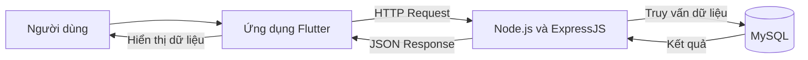

# BusGo – Ứng dụng theo dõi tuyến xe buýt

**BusGo** là ứng dụng di động giúp người dùng tra cứu nhanh chóng các tuyến xe buýt, trạm dừng, lộ trình tuyến, xem vị trí các trạm trên bản đồ và theo dõi xe buýt đang hoạt động. Ứng dụng được xây dựng bằng **Flutter** (giao diện di động) kết hợp **Node.js + Express + MySQL** (API backend) với cơ chế xác thực bằng **JWT**.

Đây là đồ án môn **"Lập trình trên thiết bị di động"** – dự án sinh viên năm 3 ngành Công nghệ thông tin.

---

## 1. Thông tin đề tài

| Mục | Nội dung |
|-----|----------|
| **Tên đề tài** | BusGo – Ứng dụng theo dõi tuyến xe buýt trên thiết bị di động |
| **Loại dự án** | Đồ án môn học "Lập trình trên thiết bị di động" (Mobile Application) |
| **Đối tượng sử dụng** | Người đi xe buýt (hành khách) cần tra cứu tuyến xe, trạm dừng và vị trí xe; người quản trị hệ thống (quản lý tài khoản người dùng) |
| **Mục tiêu chính** | Cung cấp một ứng dụng di động giúp: tìm kiếm tuyến xe phù hợp, tra cứu thông tin chi tiết tuyến, tìm trạm dừng, xem vị trí trạm và xe buýt trên bản đồ, lưu tuyến yêu thích |
| **Phạm vi hệ thống** | Ứng dụng di động Flutter (nhắm tới Android, đồng thời cấu hình chạy được trên Web và Windows để dễ chạy thử); backend API xác thực tài khoản (đăng ký / đăng nhập / JWT / đăng nhập Google); dữ liệu tuyến – trạm – xe hiện là **dữ liệu mẫu nhúng trong app**, chưa đồng bộ từ backend |

> Lưu ý: Một số thông tin về quá trình triển khai thực tế (deployment trên máy chủ, dữ liệu tuyến xe thật) chưa xác định được từ mã nguồn và sẽ được cập nhật sau.

---

## 2. Bài toán cần giải quyết

Người đi xe buýt hàng ngày gặp nhiều khó khăn, và BusGo tập trung giải quyết các vấn đề phù hợp với các chức năng đã có trong dự án:

- **Khó tìm tuyến xe phù hợp**: người dùng không biết nên đi tuyến nào giữa danh sách tuyến dài. → BusGo cung cấp danh sách tuyến kèm **hộp tìm kiếm** theo mã tuyến, tên tuyến, điểm đầu – điểm cuối.
- **Khó xác định trạm dừng**: người dùng không biết trạm nào gần mình, trạm đó tên gì. → BusGo cung cấp danh sách trạm kèm tìm kiếm theo tên/địa chỉ, xem trạm trên **bản đồ** và tính **trạm gần vị trí hiện tại nhất**.
- **Không biết thông tin chi tiết của tuyến**: giờ hoạt động, điểm đầu – điểm cuối, có bao nhiêu trạm. → BusGo hiển thị trang **chi tiết tuyến** gồm toàn bộ các trường thông tin trên, kèm hành trình dạng timeline theo thứ tự trạm.
- **Khó theo dõi hành trình và vị trí xe**: hành khách không biết xe ở đâu, liệu có tới trạm không. → BusGo có màn hình **bản đồ các trạm** trên tuyến và màn hình **theo dõi xe buýt** (hiện đang ở giai đoạn dữ liệu mô phỏng, xem mục 3).

---

## 3. Chức năng của hệ thống

### 3.1. Người dùng và xác thực

| STT | Chức năng | Mô tả | Trạng thái |
|-----|-----------|-------|------------|
| 1 | Đăng ký tài khoản | Tạo tài khoản với tên đăng nhập (3–32 ký tự, chỉ chữ/số/gạch dưới), mật khẩu (6–64 ký tự), email tùy chọn; gửi lên `POST /api/auth/register` | Hoàn thành |
| 2 | Đăng nhập | Đăng nhập bằng tên đăng nhập **hoặc email** + mật khẩu; backend kiểm tra bằng bcrypt, trả về **JWT** | Hoàn thành |
| 3 | Đăng nhập / đăng ký nhanh bằng Google | Mở hộp thoại Google, gửi ID token lên backend xác minh; tự tạo tài khoản nếu chưa có hoặc liên kết nếu trùng email | Hoàn thành |
| 4 | Kiểm tra phiên đăng nhập khi mở app (`AuthGate`) | Đọc JWT trong secure storage, gọi `GET /api/auth/me`; hợp lệ thì vào Trang chủ, hết hạn thì về màn hình Đăng nhập | Hoàn thành |
| 5 | Ghi nhớ đăng nhập | Tích ô "Ghi nhớ đăng nhập" để tên đăng nhập được điền sẵn ở lần đăng nhập sau | Hoàn thành |
| 6 | Đăng xuất | Xóa JWT khỏi secure storage và quay về màn hình Đăng nhập | Hoàn thành |
| 7 | Hồ sơ cá nhân | Xem/sửa họ tên, email, số điện thoại, ngày sinh, ảnh đại diện, danh sách địa chỉ + địa chỉ mặc định; định vị GPS và tự điền địa chỉ | Hoàn thành |
| 8 | Phân quyền người dùng (user/admin) | Backend quy định các API `PROTECTED` (cần JWT) và `ADMIN` (chỉ `role = admin`); chưa có giao diện quản trị | Hoàn thành (API) |

### 3.2. Tra cứu tuyến xe

| STT | Chức năng | Mô tả | Trạng thái |
|-----|-----------|-------|------------|
| 1 | Danh sách tuyến xe buýt | Hiển thị tất cả tuyến (kèm mã tuyến, điểm đi – điểm đến, số trạm) | Hoàn thành |
| 2 | Xem chi tiết tuyến | Số tuyến, tên tuyến, điểm đầu/cuối, giờ hoạt động, danh sách trạm dạng timeline, danh sách xe đang chạy trên tuyến | Hoàn thành |
| 3 | Yêu thích tuyến | Thêm/bỏ yêu thích một tuyến; danh sách yêu thích được lưu cục bộ trên thiết bị, có màn hình riêng | Hoàn thành |
| 4 | Thống kê tuyến | Tổng quan số tuyến, số trạm, số xe; xếp hạng trạm đông tuyến nhất, tuyến nhiều trạm nhất, xe theo tuyến | Hoàn thành |

### 3.3. Tra cứu trạm xe buýt

| STT | Chức năng | Mô tả | Trạng thái |
|-----|-----------|-------|------------|
| 1 | Danh sách trạm | Hiển thị tên trạm, địa chỉ, số tuyến đi qua trạm | Hoàn thành |
| 2 | Chi tiết trạm | Địa chỉ, tọa độ (latitude/longitude), danh sách các tuyến đi qua trạm | Hoàn thành |

### 3.4. Tìm kiếm

| STT | Chức năng | Mô tả | Trạng thái |
|-----|-----------|-------|------------|
| 1 | Tìm kiếm tuyến | Lọc tuyến theo mã tuyến, tên tuyến, điểm đầu hoặc điểm cuối | Hoàn thành |
| 2 | Tìm kiếm trạm | Lọc trạm theo tên hoặc địa chỉ | Hoàn thành |

### 3.5. Bản đồ và vị trí

| STT | Chức năng | Mô tả | Trạng thái |
|-----|-----------|-------|------------|
| 1 | Bản đồ trạm dừng | Hiển thị marker các trạm; vẽ lộ trình giữa các trạm bám theo đường đi thực tế (dịch vụ định tuyến OSRM, nền bản đồ Esri – không cần API key) | Hoàn thành |
| 2 | Lấy vị trí hiện tại | Dùng GPS (geolocator) kiểm tra/bật dịch vụ định vị, xin quyền, lấy tọa độ và hiển thị marker "Vị trí của bạn" | Hoàn thành |
| 3 | Trạm gần tôi | Tính khoảng cách từ vị trí người dùng tới các trạm bằng công thức Haversine, hiển thị 3 trạm gần nhất | Hoàn thành |
| 4 | Theo dõi vị trí xe buýt | Hiển thị xe buýt di chuyển trên bản đồ | Đang phát triển |

### 3.6. Quản lý dữ liệu

| STT | Chức năng | Mô tả | Trạng thái |
|-----|-----------|-------|------------|
| 1 | Backend xác thực | API đăng ký, đăng nhập, đăng nhập Google, lấy thông tin user hiện tại; băm mật khẩu bcrypt; ký/kiểm tra JWT | Hoàn thành |
| 2 | Cơ sở dữ liệu MySQL | Script tạo database `BusGo` và bảng `users` (bcrypt, phân quyền `role`); tự tạo bảng khi chạy backend | Hoàn thành |
| 3 | API hồ sơ & quản trị | `GET /api/user/profile` (cần JWT) và `GET /api/admin/users` (chỉ admin) | Hoàn thành |
| 4 | API dữ liệu tuyến/trạm từ backend | Trả dữ liệu tuyến – trạm – xe tập trung từ server thay vì dữ liệu mẫu trong app | Dự kiến phát triển |
| 5 | Giao diện quản trị (admin) | Màn hình quản lý tài khoản/người dùng trên ứng dụng | Dự kiến phát triển |

### 3.7. Các chức năng khác

| STT | Chức năng | Mô tả | Trạng thái |
|-----|-----------|-------|------------|
| 1 | Thông báo trong ứng dụng | Danh sách thông báo (xe đến trạm, sự cố tuyến, tin tức, tài khoản); lọc theo tab; đánh dấu đã đọc, vuốt để xóa | Đang phát triển |
| 2 | Cài đặt ứng dụng | Chế độ tối/sáng, chọn ngôn ngữ Tiếng Việt / English, tùy chọn nhận thông báo | Hoàn thành |
| 3 | Xóa bộ nhớ đệm / tải bản đồ ngoại tuyến | Nút xóa cache và tải bản đồ ngoại tuyến trong Cài đặt | Đang phát triển |
| 4 | Trợ lý ảo (VA) | Nút tròn "VA" trên Trang chủ, hiện hộp thoại giới thiệu trợ lý ảo | Dự kiến phát triển |
| 5 | Theo dõi xe theo thời gian thực | Cập nhật vị trí xe buýt thời gian thực bằng kết nối thời gian thực (ví dụ Socket.IO / nguồn dữ liệu GPS thật) | Dự kiến phát triển |

---

## 4. Quy trình hoạt động của hệ thống

Luồng hoạt động tổng quát của BusGo:

1. Người dùng mở ứng dụng Flutter (`lib/main.dart` → `AuthGate` kiểm tra phiên đăng nhập).
2. Ứng dụng gửi yêu cầu đến REST API tại địa chỉ cấu hình trong `lib/config/api_config.dart`.
3. Backend Node.js và ExpressJS tiếp nhận yêu cầu qua các router ở `server/src/routes`.
4. Backend kiểm tra và xử lý dữ liệu: validate đầu vào (middleware), xác thực JWT nếu cần, xử lý nghiệp vụ trong controller, băm/so sánh mật khẩu bằng bcrypt.
5. Backend truy vấn hoặc cập nhật dữ liệu trong MySQL thông qua Sequelize ORM.
6. MySQL trả kết quả cho backend.
7. Backend trả dữ liệu JSON về ứng dụng theo định dạng chuẩn `{ success, message, data }`.
8. Flutter xử lý và hiển thị kết quả cho người dùng.



**Ví dụ luồng đăng nhập** (được triển khai trong `AuthService`, `AuthGate`):

```mermaid
sequenceDiagram
    participant A as Ứng dụng Flutter
    participant B as Backend (Express)
    participant D as MySQL
    A->>B: POST /api/auth/login (tên đăng nhập/email + mật khẩu)
    B->>D: Tìm user theo username/email
    D-->>B: User (mật khẩu đã băm bcrypt)
    B->>B: So sánh bcrypt, ký JWT
    B-->>A: { success, token, user }
    A->>A: Lưu JWT vào secure storage
    A->>B: GET /api/auth/me (Authorization: Bearer &lt;JWT&gt;)
    B-->>A: Thông tin user hợp lệ → vào Trang chủ
```

> Chú ý: Các màn hình tra cứu tuyến – trạm – xe (danh sách, chi tiết, bản đồ, thống kê, thông báo) hiện đọc từ **dữ liệu mẫu nhúng trong app** (`lib/data/sample_data.dart`, `lib/data/sample_notifications.dart`) nên hoạt động ngay cả khi backend chưa chạy. Chỉ các chức năng liên quan tài khoản mới bắt buộc gọi API.

---

## 5. Công nghệ sử dụng

| Thành phần | Công nghệ | Ghi chú |
|------------|-----------|---------|
| Ứng dụng di động | Flutter + Dart (SDK ^3.12.0) | Chạy được trên Android, Web, Windows |
| Quản lý trạng thái | `ChangeNotifier` / `ListenableBuilder` (Singleton services) | Không dùng thư viện ngoài |
| Giao tiếp mạng | `http` (RESTful API) | API trả JSON |
| Xác thực | **JWT** (`flutter_secure_storage` lưu token), **bcrypt** (băm mật khẩu server) | Token hết hạn mặc định 7 ngày |
| Đăng nhập Google | `google_sign_in` (Android/iOS/macOS/Web) + `google-auth-library` (xác minh token phía server) | |
| Bản đồ | `flutter_map` + `latlong2`; nền bản đồ Esri World Street Map (miễn phí, không cần API key) | |
| Định tuyến lộ trình | API OSRM (miễn phí) | Vẽ đường đi thực tế giữa các trạm |
| Đảo tọa độ thành địa chỉ | OpenStreetMap Nominatim, dự phòng BigDataCloud | Tính năng "Lấy vị trí hiện tại" ở phần địa chỉ |
| Vị trí GPS | `geolocator` | Kiểm tra quyền, lấy tọa độ, tính khoảng cách Haversine |
| Lưu trữ cục bộ | `shared_preferences` (yêu thích, hồ sơ, cài đặt, nhớ đăng nhập) | |
| Ảnh đại diện | `image_picker` | Chọn ảnh từ thư viện thiết bị |
| Backend | Node.js + ExpressJS | ES Module |
| Cơ sở dữ liệu | MySQL + Sequelize (ORM) | Database `BusGo`, bảng `users` |
| Đa ngôn ngữ | Hệ thống `l10n` tự xây dựng (Tiếng Việt / English) | Không dùng codegen `intl` |
| Kiểm thử | `flutter_test` | 2 bộ test trong thư mục `test/` |
| Công cụ hỗ trợ | Git / GitHub (repository git) | |

Các công cụ khác (`Socket.IO`, `Postman`, `XAMPP`, `Docker`): nếu được dùng trong quá trình làm bài, phần này sẽ được bổ sung. Trong mã nguồn hiện tại **chưa thấy** cấu hình Socket.IO hay Docker.

> **Socket.IO** chưa được triển khai trong mã nguồn. Nếu có trong tương lai, nó được dùng cho mục tiêu cập nhật vị trí xe buýt theo thời gian thực (hiện tại dữ liệu vị trí xe là mô phỏng bằng `Timer`).

---

## 6. Cấu trúc thư mục

```
busgo/
├── lib/                          # Mã nguồn ứng dụng Flutter
│   ├── main.dart                 # Điểm khởi động, cấu hình theme/ngôn ngữ
│   ├── config/                   # Cấu hình API và Google OAuth
│   │   ├── api_config.dart       #   Địa chỉ gốc API
│   │   └── google_config.dart    #   Client ID Google (Web/Android)
│   ├── data/                     # Dữ liệu mẫu (tuyến, trạm, xe, thông báo)
│   ├── l10n/                     # Hệ thống đa ngôn ngữ (vi/en)
│   ├── models/                   # Các lớp dữ liệu (BusRoute, BusStop, Bus...)
│   ├── screens/                  # Các màn hình
│   │   ├── auth/                 #   Đăng nhập, đăng ký, kiểm tra phiên (AuthGate)
│   │   ├── home_screen.dart      #   Trang chủ (lưới chức năng + menu dưới)
│   │   ├── bus_route_list_screen.dart / route_detail_screen.dart
│   │   ├── bus_stop_list_screen.dart / stop_detail_screen.dart
│   │   ├── map_screen.dart       #   Bản đồ trạm + GPS + trạm gần nhất
│   │   ├── bus_tracking_screen.dart   #   Theo dõi xe (dữ liệu mô phỏng)
│   │   ├── favorite_screen.dart  #   Tuyến yêu thích
│   │   ├── statistics_screen.dart    #   Thống kê
│   │   ├── notification_screen.dart  #   Thông báo
│   │   ├── settings_screen.dart      #   Cài đặt
│   │   └── profile_screen.dart / edit_profile_screen.dart
│   ├── services/                 # Các dịch vụ (API, auth, vị trí, cài đặt...)
│   ├── theme/                    # Theme sáng/tối
│   └── widgets/                  # Widget dùng chung (RouteCard, nút Google...)
├── server/                       # Backend Node.js + Express + MySQL
│   ├── .env.example              # File mẫu cấu hình môi trường
│   ├── package.json              # Thư viện backend
│   ├── sql/BusGo.sql             # Script tạo database + bảng users
│   └── src/
│       ├── server.js             # Điểm khởi động API, gắn middleware/router
│       ├── config/db.js          # Kết nối MySQL qua Sequelize
│       ├── controllers/          # Xử lý nghiệp vụ (auth, user)
│       ├── middlewares/          # Xác thực JWT, requireAdmin, validate
│       ├── models/User.js        # Model bảng users
│       ├── routes/               # auth.routes, user.routes
│       └── utils/                # jwt, bcrypt, google, response
├── android/ web/ windows/        # Cấu hình nền tảng Flutter
├── test/                         # Widget test + test luồng chức năng
└── pubspec.yaml                  # Khai báo dependencies của Flutter app
```

---

## 7. Hướng dẫn cài đặt và chạy

### 7.1. Chuẩn bị

- Cài [Flutter](https://docs.flutter.dev/get-started/install) (SDK >= 3.12) và [Node.js](https://nodejs.org/) (>= 16 khuyến nghị).
- Cài MySQL (hoặc XAMPP – tùy môi trường cá nhân) và tạo database.

### 7.2. Khởi tạo database

Chạy script tạo database `BusGo` trong MySQL:

```sql
-- Mở MySQL (Command Line / MySQL Workbench / phpMyAdmin) và chạy:
source server/sql/BusGo.sql;
```

Script tạo database `BusGo` (UTF-8, hỗ trợ tiếng Việt) và bảng `users`. Khi chạy backend, Sequelize tự đồng bộ bảng nếu chưa tồn tại.

> Để tạo tài khoản quản trị thử, chạy: `UPDATE users SET role = 'admin' WHERE username = 'ten_admin_cua_ban';`

### 7.3. Khởi chạy backend

```bash
cd server
npm install

# Tạo file .env từ file mẫu và điền thông tin (xem mục 8):
#   Windows: copy .env.example .env
#   Linux/macOS: cp .env.example .env

npm start        # API chạy tại http://localhost:3000 (mặc định)
# hoặc: npm run dev   (tự khởi động lại khi sửa code)
```

### 7.4. Khởi chạy ứng dụng Flutter

```bash
flutter pub get
flutter run
```

**Cấu hình địa chỉ API** trong `lib/config/api_config.dart`:

| Môi trường chạy | Giá trị `baseUrl` |
|-----------------|-------------------|
| Windows / Web / máy thật | `http://localhost:3000/api` |
| Android Emulator | `http://10.0.2.2:3000/api` |
| Điện thoại thật | Địa chỉ IP LAN của máy chạy backend, ví dụ `http://192.168.1.10:3000/api` |

### 7.5. Kiểm thử

```bash
flutter test
```

Dự án có 2 bộ test: kiểm tra màn hình Đăng nhập hiển thị lúc mở app, và bộ test luồng chức năng chính (danh sách tuyến → tìm kiếm → chi tiết → trạm → bản đồ → theo dõi xe → yêu thích).

---

## 8. Cấu hình biến môi trường (.env)

Sao chép `server/.env.example` thành `server/.env` và điền các giá trị **mẫu** (không dùng khóa thật):

```env
# Cổng chạy API (mặc định 3000)
PORT=3000

# Kết nối MySQL
DB_HOST=localhost
DB_PORT=3306
DB_USER=root
DB_PASSWORD=mat_khau_mysql_cua_ban
DB_NAME=BusGo

# Khóa bí mật ký JWT – bắt buộc, chuỗi dài khó đoán
JWT_SECRET=chuoi_khoa_bi_mat_that_dai_kho_doan
# Thời gian token hợp lệ (7d = 7 ngày)
JWT_EXPIRES_IN=7d

# Client ID Web của Google OAuth (nhiều ID phân cách bằng dấu phẩy)
GOOGLE_CLIENT_ID=xxxxx.apps.googleusercontent.com
```

> **Cảnh báo:** không bao giờ đưa file `.env` lên GitHub (file đã nằm trong `.gitignore`). Không commit `JWT_SECRET`, mật khẩu MySQL hay client ID thật vào repository.

**Cấu hình "Đăng nhập bằng Google"** (cần thiết nếu muốn dùng tính năng này):

1. Vào Google Cloud Console → **APIs & Services → Credentials → Create Credentials → OAuth client ID**.
2. Tạo 2 loại client: **Web application** (lấy `WEB_CLIENT_ID`) và **Android** (package `com.example.busgo` + SHA-1 chứng chỉ ký, lấy bằng `keytool -list -v -keystore debug.keystore -alias androiddebugkey`).
3. Điền client ID vào:
   - `lib/config/google_config.dart` → `webClientId` và `androidClientId` (để trống nếu không cấu hình Android).
   - `server/.env` → `GOOGLE_CLIENT_ID` (= `WEB_CLIENT_ID`, bắt buộc để server xác minh token).
   - `web/index.html` → thẻ meta `google-signin-client_id` (để chạy trên Web).
4. Với Web client, khai báo **Authorized JavaScript origins** là `http://localhost:PORT`.

> Người dùng đăng nhập bằng Google được tự động tạo tài khoản (username sinh từ email) hoặc liên kết với tài khoản đã đăng ký trước đó nếu trùng email, không cần đặt mật khẩu.

---

## 9. Danh sách API

Định dạng phản hồi chuẩn của mọi API: `{ "success": true/false, "message": "...", "data": ... }`.

| Phương thức | Đường dẫn | Mô tả | Quyền |
|-------------|-----------|-------|-------|
| `GET` | `/health` | Kiểm tra máy chủ hoạt động | Public |
| `POST` | `/api/auth/register` | Đăng ký tài khoản mới (`username`, `password`, `email?`, `name?`) | Public |
| `POST` | `/api/auth/login` | Đăng nhập bằng username/email + mật khẩu → trả `{ token, user }` | Public |
| `POST` | `/api/auth/google` | Đăng nhập/đăng ký nhanh bằng Google (`idToken`) | Public |
| `GET` | `/api/auth/me` | Lấy thông tin user hiện tại | JWT |
| `GET` | `/api/user/profile` | Lấy hồ sơ cá nhân của user đang đăng nhập | JWT |
| `GET` | `/api/admin/users` | Danh sách tất cả tài khoản | JWT + `role = admin` |

Mọi API protected gửi token qua header: `Authorization: Bearer <JWT_TOKEN>`. Ứng dụng Flutter tự động đính kèm header này thông qua `ApiService`.

---

## 10. Bảo mật và các lưu ý

- **Mật khẩu** luôn được băm bằng **bcrypt** (10 vòng) trước khi lưu, không bao giờ lưu văn bản thô.
- **JWT** được ký bằng `JWT_SECRET` lấy từ `.env` (server sẽ **dừng ngay** nếu thiếu biến này), hết hạn mặc định 7 ngày.
- **JWT và thông tin user** được lưu trong **secure storage** (Android Keystore, Credential Manager trên Windows...) thay vì file text thường.
- **Đăng nhập Google**: app không tự tin tưởng ID token mà server xác minh lại chữ ký + `aud` + `email_verified` với Google trước khi cấp JWT.
- Không gửi vị trí người dùng lên server: GPS được xử lý cục bộ trong app (mục "Trạm gần tôi", địa chỉ khi sửa hồ sơ).
- Ứng dụng xử lý đầy đủ các trạng thái lỗi (mất mạng, hết hạn token, từ chối quyền GPS...) với thông báo tiếng Việt, không bị treo/crash.

---

## 11. Định hướng phát triển trong tương lai

1. **Đồng bộ dữ liệu tuyến – trạm – xe** lên backend (thay dữ liệu mẫu nhúng trong app bằng API).
2. **Theo dõi xe thời gian thực**: thay dữ liệu mô phỏng bằng nguồn GPS thật, có thể qua **Socket.IO**.
3. **Giao diện quản trị** (admin) trên ứng dụng để quản lý tài khoản, tuyến, trạm.
4. **Thông báo** kết nối dữ liệu backend và gửi thông báo thực tế khi xe sắp đến trạm.
5. **Trợ lý ảo (VA)** hỏi đáp tự động về tuyến xe.
6. **Bản đồ ngoại tuyến** và hoàn thiện tính năng xóa bộ nhớ đệm.

---

## 12. Kết luận

BusGo là ứng dụng di động theo dõi tuyến xe buýt được xây dựng theo mô hình **client – server**: giao diện Flutter thân thiện (đa ngôn ngữ vi/en, chế độ sáng/tối, có bản đồ và GPS) kết hợp backend Node.js/Express/MySQL xác thực tài khoản chắc chắn bằng JWT + bcrypt và đăng nhập Google. Dự án hiện đã hoàn thiện các chức năng tra cứu tuyến – trạm – bản đồ – tài khoản, đang phát triển theo dõi xe thời gian thực và là nền tảng phù hợp để tiếp tục mở rộng trong các giai đoạn sau.